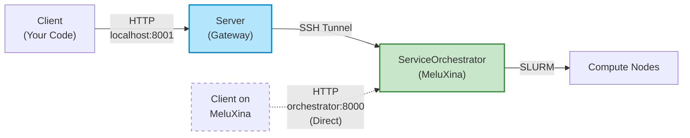

# Server API Documentation

## Architecture Overview

The system uses a **gateway-orchestrator architecture** with two components:



**Two Access Patterns:**

1. **External Access (typical)**: `Client → Server (localhost:8001) → SSH → Orchestrator → SLURM`
   - Use when running client code on your laptop/workstation
   - Server acts as a gateway, forwarding all requests to MeluXina
   - All examples below use this pattern

2. **Internal Access (advanced)**: `Client → Orchestrator (orchestrator:8000) directly`
   - Use when running client code **on MeluXina** (e.g., in a compute job)
   - Bypasses the gateway for lower latency
   - Requires access to MeluXina internal network

**API Endpoint Translation:**

| Client Request | Server Gateway | Orchestrator Internal API |
|----------------|----------------|---------------------------|
| `POST /api/v1/services` | Proxies to → | `POST /api/services/start` |
| `GET /api/v1/services` | Proxies to → | `GET /api/services` |
| `DELETE /api/v1/services/{id}` | Proxies to → | `POST /api/services/stop/{id}` |
| `POST /api/v1/services/{id}/status` | Proxies to → | Handled internally by orchestrator |
| `POST /api/v1/vllm/{id}/prompt` | Proxies to → | `POST /api/services/vllm/{id}/prompt` |

## Interactive API Reference

The Server Gateway provides a REST API for managing SLURM jobs and AI workload orchestration.

<swagger-ui src="server-openapi.json"/>


## API Examples

### Create vLLM Service with Default Model

Create a single-node vLLM service with default configuration (Qwen/Qwen2.5-0.5B-Instruct):

```bash
curl -X POST http://localhost:8001/api/v1/services \
  -H "Content-Type: application/json" \
  -d '{
    "recipe_name": "inference/vllm-single-node"
  }'
```

By default, this will use one slurm node with its 4 GPUs for tensor-parallelism.
Currently, multi-node-multi-gpu is not supported, only single-node-multi-gpu. 

### Create Multi-Replica vLLM Service Group

Create multiple vLLM replicas on a single node for high-throughput workloads. Each replica uses a subset of GPUs and listens on a different port:

```bash
curl -X POST http://localhost:8001/api/v1/services \
  -H "Content-Type: application/json" \
  -d '{
    "recipe_name": "inference/vllm-replicas"
  }'
```

**How it works:**
- Default: 4 GPUs with `gpu_per_replica: 1` -> 4 replicas (ports 8001-8004)
- Each replica runs independently on the same node
- Requests are load-balanced using round-robin with automatic failover
- If a replica fails, traffic routes to healthy replicas

**Customizing replicas:**
```bash
curl -X POST http://localhost:8001/api/v1/services \
  -H "Content-Type: application/json" \
  -d '{
    "recipe_name": "inference/vllm-replicas",
    "config": {
      "resources": {
        "gpu": "4"
      },
      "gpu_per_replica": 2
    }
  }'
```
This creates 4 replicas (4 GPUs ÷ 2 GPUs per replica) on a single node.

### Create vLLM Service with Custom Model

Specify a different model from HuggingFace:

```bash
curl -X POST http://localhost:8001/api/v1/services \
  -H "Content-Type: application/json" \
  -d '{
    "recipe_name": "inference/vllm-single-node",
    "config": {
      "environment": {
        "VLLM_MODEL": "gpt2"
      }
    }
  }'
```

### Query Available Models

Before creating a service, you can search HuggingFace Hub for compatible models:

```bash
# Get supported architectures and examples
curl http://localhost:8001/api/v1/vllm/available-models

# Search for models (e.g., Qwen models)
curl "http://localhost:8001/api/v1/vllm/search-models?query=qwen&limit=10"

# Get detailed info about a specific model
curl http://localhost:8001/api/v1/vllm/model-info/Qwen/Qwen2.5-7B-Instruct
```

These endpoints return model compatibility information, download statistics, and architecture details to help you choose the right model for your use case.

### Create vLLM Service with Custom Model and Resources

Override both model and resource allocation (only single node supported for now):

```bash
curl -X POST http://localhost:8001/api/v1/services \
  -H "Content-Type: application/json" \
  -d '{
    "recipe_name": "inference/vllm-single-node",
    "config": {
      "environment": {
        "VLLM_MODEL": "gpt2"
      },
      "resources": {
        "cpu": "8",
        "memory": "64G",
        "time_limit": 120,
        "gpu": "4"
      }
    }
  }'
```

### Create vLLM Service with All Options

Full configuration with all available environment variables and resource settings:

```bash
curl -X POST http://localhost:8001/api/v1/services \
  -H "Content-Type: application/json" \
  -d '{
    "recipe_name": "inference/vllm-single-node",
    "config": {
      "environment": {
        "VLLM_MODEL": "gpt2",
        "VLLM_HOST": "0.0.0.0",
        "VLLM_PORT": "8001",
        "VLLM_MAX_MODEL_LEN": "2048",
        "VLLM_TENSOR_PARALLEL_SIZE": "4",
        "VLLM_GPU_MEMORY_UTILIZATION": "0.9",
        "CUDA_VISIBLE_DEVICES": "0"
      },
      "resources": {
        "cpu": "2",
        "memory": "32G",
        "time_limit": 15,
        "gpu": "4"
      }
    }
  }'
```

### Create CPU-Only vLLM Service

For testing or when GPU is not available:

```bash
curl -X POST http://localhost:8001/api/v1/services \
  -H "Content-Type: application/json" \
  -d '{
    "recipe_name": "inference/vllm-single-node",
    "config": {
      "environment": {
        "VLLM_MODEL": "gpt2"
      },
      "resources": {
        "nodes": 1,
        "cpu": "4",
        "memory": "16G",
        "gpu": null
      }
    }
  }'
```

### List Service Groups

Get all replica groups with their status:

```bash
curl http://localhost:8001/api/v1/service-groups
```

### Get Service Group Details

Get information about a specific replica group:

```bash
curl http://localhost:8001/api/v1/service-groups/3652098
```

Response includes replica count, job IDs, ports, and health status.

### Get Service Group Status

Check aggregated status across all replicas:

```bash
curl http://localhost:8001/api/v1/service-groups/3652098/status
```

Returns:
- `overall_status`: Aggregate state (all running, partially running, etc.)
- `healthy_replicas`: Count of ready replicas
- `total_replicas`: Total replica count
- `replica_statuses`: Per-replica status and endpoints

### Stop Service Group

**Recommended method** (preserves metadata for analysis):

```bash
curl -X POST http://localhost:8001/api/v1/service-groups/3652098/status \
  -H "Content-Type: application/json" \
  -d '{"status": "cancelled"}'
```

Response:
```json
{
  "success": true,
  "message": "Service group 3652098 status updated to cancelled",
  "group_id": "3652098",
  "replicas_updated": 4
}
```

**Legacy method** (deprecated):

```bash
curl -X DELETE http://localhost:8001/api/v1/service-groups/3652098
```

Both methods cancel the underlying SLURM job(s), stopping all replicas. The POST method is preferred as it preserves service records for logging and Grafana integration.

### List All Services

```bash
curl http://localhost:8001/api/v1/services
```

### Get Service Details

```bash
curl http://localhost:8001/api/v1/services/3652098
```

### Check Service Status

```bash
curl http://localhost:8001/api/v1/services/3652098/status
```

### Get Service Logs

```bash
curl http://localhost:8001/api/v1/services/3652098/logs
```

### Stop a Service

**Recommended method** (preserves metadata for analysis):

```bash
curl -X POST http://localhost:8001/api/v1/services/3652098/status \
  -H "Content-Type: application/json" \
  -d '{"status": "cancelled"}'
```

**Legacy method** (deprecated):

```bash
curl -X DELETE http://localhost:8001/api/v1/services/3652098
```

The POST method is preferred as it preserves service records for logging and Grafana integration.

### List vLLM Services

Get all running vLLM services with their endpoints:

```bash
curl http://localhost:8001/api/v1/vllm/services
```

### Get Available Models

Check which models are loaded in a vLLM service:

```bash
curl http://localhost:8001/api/v1/vllm/3652098/models
```

### Send Prompt to vLLM Service

Send a text prompt to a single service or service group (automatically routes to a healthy replica):

```bash
curl -X POST http://localhost:8001/api/v1/vllm/3652098/prompt \
  -H "Content-Type: application/json" \
  -d '{
    "prompt": "Tell me a joke about programming",
    "max_tokens": 100
  }'
```

**Service group response includes routing information:**
```json
{
  "success": true,
  "text": "Why do programmers prefer dark mode?...",
  "routed_to": "3652098:8002",
  "group_id": "3652098",
  "total_replicas": 4,
  "usage": {...}
}
```

The `routed_to` field shows which replica handled the request (job_id:port).

### Send Prompt with Advanced Options

```bash
curl -X POST http://localhost:8001/api/v1/vllm/3652098/prompt \
  -H "Content-Type: application/json" \
  -d '{
    "prompt": "Write a short haiku about AI",
    "model": "gpt2",
    "max_tokens": 64,
    "temperature": 0.7
  }'
```

### List Available Recipes

```bash
curl http://localhost:8001/api/v1/recipes
```

### Get Recipe Details

```bash
curl http://localhost:8001/api/v1/recipes/vllm-single-node
```

## Vector DB (Qdrant) Examples

### List Collections

Get the list of collections from a running Qdrant service (replace SERVICE_ID):

```bash
curl http://localhost:8001/api/v1/vector-db/3642875/collections
```

### Create Collection

Create a collection named `my_documents` with 384-dimensional vectors using Cosine distance:

```bash
curl -X PUT "http://localhost:8001/api/v1/vector-db/3642875/collections/my_documents" \
  -H "Content-Type: application/json" \
  -d '{"vector_size": 384, "distance": "Cosine"}'
```

### Upsert Points

Insert one or more points into a collection. Each point must contain `id` and `vector` and may include a `payload`:

```bash
curl -X PUT "http://localhost:8001/api/v1/vector-db/3642875/collections/my_documents/points" \
  -H "Content-Type: application/json" \
  -d '{
    "points": [
      {"id": 1, "vector": [0.1, 0.2, 0.3, 0.4], "payload": {"text": "First document"}},
      {"id": 2, "vector": [0.4, 0.5, 0.6, 0.7], "payload": {"text": "Second document"}}
    ]
  }'
```

### Search Points

Perform a similarity search against a collection (returns most similar points):

```bash
curl -X POST "http://localhost:8001/api/v1/vector-db/3642875/collections/my_documents/points/search" \
  -H "Content-Type: application/json" \
  -d '{"query_vector": [0.1, 0.2, 0.3, 0.4], "limit": 5}'
```

## Metrics Examples

### Qdrant Metrics (Prometheus)

Qdrant exposes Prometheus-compatible metrics on `/metrics`. Fetch raw metrics (text format):

```bash
curl http://localhost:8001/api/v1/vector-db/3642875/metrics
```

### vLLM Metrics (Prometheus)

vLLM exposes Prometheus-compatible metrics on `/metrics`. Fetch raw metrics (text format):

```bash
curl http://localhost:8001/api/v1/vllm/3642874/metrics
```

## Notes

### Python examples

If you prefer runnable Python demos that exercise the Server API (vector DB and vLLM flows), see the `examples/` folder at the repository root. Notable scripts:

- `examples/qdrant_simple_example.py`
- `examples/qdrant_simple_example_with_metrics.py`
- `examples/vllm_simple_example.py`
- `examples/vllm_simple_example_with_metrics.py`

Run an example locally (adjust arguments or SERVICE_ID inside the script where required):

```bash
python3 examples/vllm_simple_example.py
```

### Service Behavior

- **Default Model**: If not specified, services use `Qwen/Qwen2.5-0.5B-Instruct`
- **Model Sources**: Models must be available on HuggingFace or cached locally
- **Resource Defaults**: Each recipe has default resource allocations that can be overridden
- **Status Values**: Services progress through states: `pending` → `configuring` → `running`
- **Service ID**: The SLURM job ID is used as the service identifier
- **Load Balancing**: Replica groups use round-robin with health checks and automatic failover
- **Replica Ports**: Each replica gets a unique port (base_port + index), e.g., 8001, 8002, 8003, 8004
