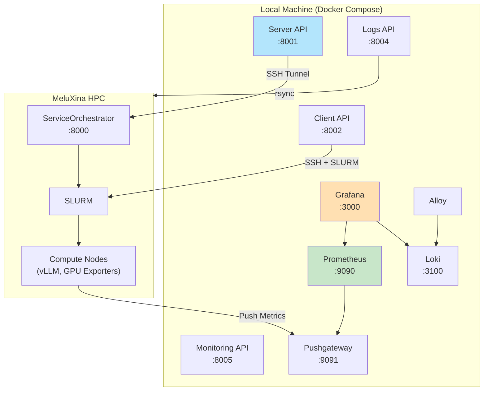

# System Architecture

## Overview

The AI Factory Benchmarking Framework uses a **microservices architecture** to provide flexible, scalable benchmarking of AI infrastructure components on HPC systems. Importantly, the system is designed to handle an arbitrary number of benchmarks running in parallel, enabling you to orchestrate multiple concurrent experiments rather than being restricted to a single active task.

## High-Level Architecture

## Core Components

### 1. Server Service

**Purpose**: Central orchestration hub for service deployment and management.

**Overview**:
- Acts as a gateway proxying requests to the ServiceOrchestrator on MeluXina via SSH tunnels
- Manages vLLM and vector database deployments through SLURM
- Provides service discovery endpoints for Prometheus

[Learn more →](../api/server.md)

### 2. Client Service

**Purpose**: Execute benchmark workloads against deployed services.

**Overview**:
- Submits SLURM jobs that spawn concurrent load-generating clients
- Coordinates distributed load testing across compute nodes
- Exports request latency and throughput metrics to Prometheus

[Learn more →](../services/client.md)

### 3. Monitoring Service

**Purpose**: Collect and export performance metrics.

**Overview**:
- Configures Prometheus scrape targets dynamically
- Manages monitoring sessions with time-windowed collection
- Exports metrics artifacts for offline analysis

[Learn more →](../services/monitoring.md)

### 4. Logging Service

**Purpose**: Aggregate and forward logs for analysis.

**Overview**:
- Syncs SLURM job logs from MeluXina via rsync
- Categorizes logs by service type (vllm, client, server, etc.)
- Provides REST API for log querying and retrieval

[Learn more →](../services/logs.md)

### 5. Web Dashboard (Grafana)

**Purpose**: Visualization and control interface.

**Overview**:
- Pre-configured dashboards for GPU metrics and service status
- Administration panels for starting/stopping benchmarks
- Real-time visualization of load test results

## Data Flow

### Metrics Collection Flow

1. **GPU Exporter** runs on compute nodes, collects nvidia-smi metrics
2. Metrics are **pushed to Pushgateway** (handles network isolation)
3. **Prometheus scrapes** Pushgateway and service endpoints
4. **Grafana queries** Prometheus for visualization

### Log Collection Flow

1. SLURM jobs write stdout/stderr to MeluXina filesystem
2. **Logs Service** periodically syncs via rsync/SSH
3. Logs are **categorized** by service type
4. **Alloy** forwards to **Loki** for centralized storage

## Deployment Model

### Container Orchestration

The local stack runs via Docker Compose with the following services:
- `server` (port 8001)
- `client` (port 8002)
- `logs` (port 8004)
- `monitoring` (port 8005)
- `prometheus` (port 9090)
- `pushgateway` (port 9091)
- `grafana` (port 3000)
- `loki` (port 3100)
- `alloy` (log forwarding)

### SLURM Integration

AI workloads (vLLM, load generators) run as SLURM jobs on MeluXina compute nodes with GPU allocation.

---

Next: [Server Service](../services/server.md) | [Client Service](../services/client.md)
