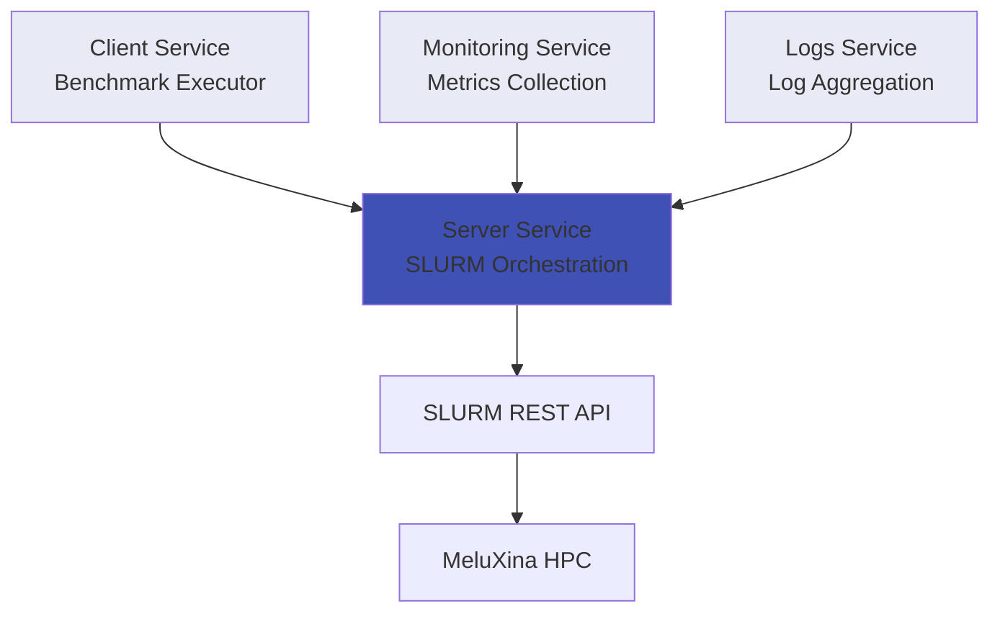

# AI Factory Benchmarking Framework

Welcome to the AI Factory Benchmarking Framework documentation.

## Overview

This framework enables benchmarking of AI Factory components on HPC systems, specifically designed for the MeluXina supercomputer. The system orchestrates AI workloads via SLURM and provides comprehensive monitoring and testing capabilities.

## Architecture

The framework consists of four microservices:

### Services

- **Server** - Core orchestration service that manages SLURM job submissions and AI workload deployment
- **Client** - Executes benchmark tests and workload simulations (TODO: Documentation in progress)
- **Monitoring** - Collects and aggregates performance metrics (TODO: Documentation in progress)
- **Logs** - Centralized log collection and analysis (TODO: Documentation in progress)

## Quick Start

See [Getting Started](getting-started/overview.md) for detailed instructions.

## Documentation

- [Getting Started](getting-started/overview.md) - Setup and installation
- [Architecture](architecture/overview.md) - System design and components
- [Server Service](services/server/overview.md) - Detailed server documentation
- [API Reference](api/server.md) - Interactive API documentation
- [Development](development/setup.md) - Development guidelines

## Status

**Current Version**: 1.0.0  
**Last Updated**: October 2025  
**Project**: EUMaster4HPC Challenge 2025-2026

