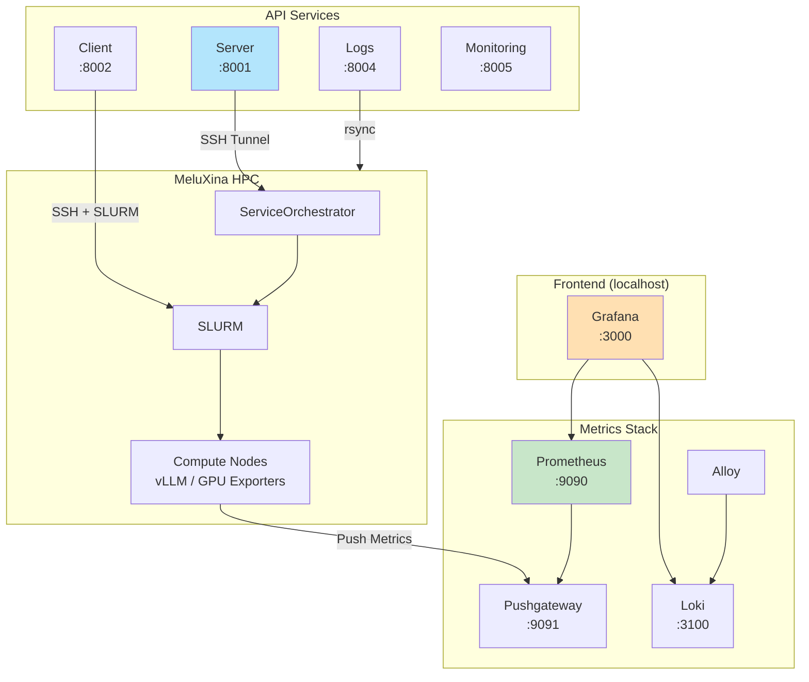

# AI Factory Benchmarking Framework

Welcome to the AI Factory Benchmarking Framework documentation.

## Overview

This framework enables benchmarking of AI Factory components on HPC systems, specifically designed for the MeluXina supercomputer. The application orchestrates AI workloads via SLURM and provides monitoring in real-time, all controlable through a Grafana UI.

## Architecture

The framework consists of multiple microservices working together:

### Services

| Service | Port | Description |
|---------|------|-------------|
| **Server** | 8001 | Core orchestration - manages SLURM jobs and AI workload deployment |
| **Client** | 8002 | Executes distributed load tests against AI services |
| **Logs** | 8004 | Syncs and categorizes SLURM job logs from MeluXina |
| **Monitoring** | 8005 | Manages Prometheus scrape targets and metrics collection |
| **Grafana** | 3000 | Visualization dashboard for metrics and benchmarks |
| **Prometheus** | 9090 | Time-series metrics storage |
| **Pushgateway** | 9091 | Buffers metrics from HPC compute nodes |

## Quick Start

See [Getting Started](getting-started/overview.md) for detailed instructions.

## Documentation

- [Getting Started](getting-started/overview.md) - Setup and installation
- [Architecture](architecture/overview.md) - System design and components
- [Server Service](services/server.md) - Detailed server documentation
- [API Reference](api/server.md) - Interactive API documentation
- [Development](development/guidelines.md) - Development guidelines

## Status

**Current Version**: 1.0.0  
**Last Updated**: January 2026  
**Project**: EUMaster4HPC Challenge 2025-2026

