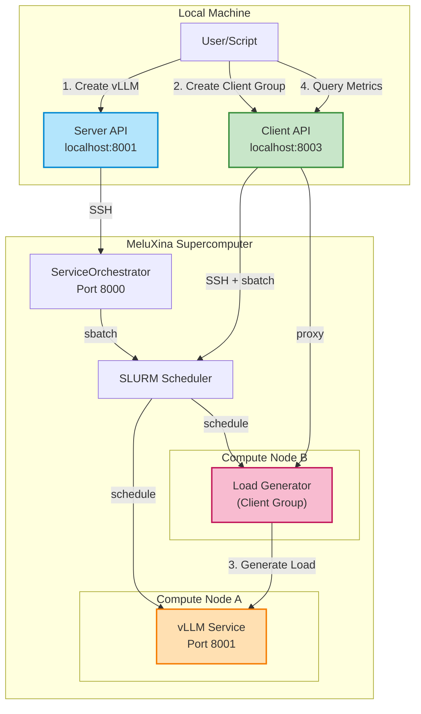
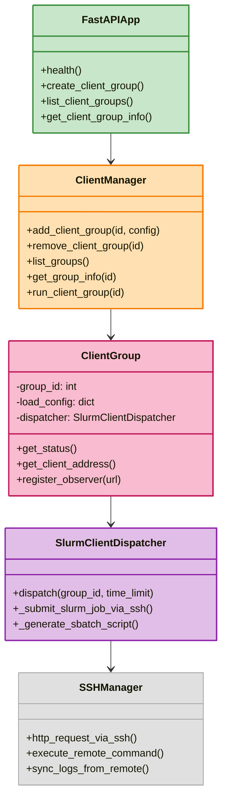

# Client Service

## Overview

The Client Service manages distributed load testing and benchmarking of AI inference services on HPC clusters. It orchestrates client groups that generate realistic workloads against vLLM and other AI services deployed via the Server.

!!! tip "Live API Explorer"
    The best way to explore the API is here:
    
    **[Open Interactive API Docs](../../api/client){ .md-button .md-button--primary }**

## What It Does

The Client Service has the following functionalities:

- Submit SLURM jobs that spawn multiple concurrent clients
- Create groups of clients that generate coordinated load
- Export Prometheus metrics for real-time monitoring
- Collect and save detailed performance results
- Discover and monitor running client groups

## Architecture

The Client Service works in conjunction with the Server to create end-to-end benchmarking pipelines:



## Concepts

### Client Groups

A **client group** is a collection of concurrent clients running on HPC compute nodes. Each group:

- Runs as a SLURM job on MeluXina
- Contains N concurrent client threads/processes
- Generates load at a target rate (requests per second)
- Reports metrics via Prometheus
- Saves detailed results to log files

### Workflow

1. **Create Service**: User creates a vLLM service via Server API
2. **Wait for Ready**: Service starts and models are loaded
3. **Create Client Group**: User creates a client group via Client API
4. **Generate Load**: Clients send concurrent requests to the vLLM service

### Load Test Configuration

Each client group is configured with:

- `service_id`: ID of the target vLLM service (or group of services)
- `num_clients`: Number of concurrent client threads (1-1000)
- `requests_per_second`: Target RPS across all clients
- `duration_seconds`: How long to run the test
- `prompts`: List of prompts to randomly sample from
- `max_tokens`: Maximum tokens to generate per request
- `temperature`: Sampling temperature (0.0-2.0)
- `time_limit`: SLURM job time limit in minutes

## Components



### Component Responsibilities

**FastAPI App**: REST API endpoints for external clients

**ClientManager**: Singleton that manages all client groups
  - Tracks active groups by ID
  - Coordinates group creation/deletion
  - Resolves orchestrator endpoint from Server

**ClientGroup**: Represents a single SLURM job with N clients
  - Stores load test configuration
  - Tracks registration status
  - Provides access to client process metrics

**SlurmClientDispatcher**: Submits SLURM jobs via SSH
  - Generates sbatch scripts
  - Submits jobs to SLURM scheduler
  - Handles job configuration (time limits, resources)

**SSHManager**: SSH communication with MeluXina
  - Executes remote commands
  - Syncs log files
  - Manages SSH tunnels

## Usage Examples

### Basic Load Test

Create a vLLM service, then run a simple load test:

```python
import requests
import time

SERVER_API = "http://localhost:8001/api/v1"
CLIENT_API = "http://localhost:8003/api/v1"

# 1. Create vLLM service
response = requests.post(f"{SERVER_API}/services", json={
    "recipe_name": "inference/vllm-single-node"
})
service = response.json()
service_id = service["id"]

print(f"Created service {service_id}, waiting for ready...")

# 2. Wait for service to be ready (poll status)
while True:
    status = requests.get(f"{SERVER_API}/services/{service_id}/status").json()
    if status["status"] == "running":
        # Check if vLLM is ready
        try:
            models = requests.get(f"{SERVER_API}/vllm/{service_id}/models").json()
            if models.get("success"):
                print("Service ready!")
                break
        except:
            pass
    time.sleep(5)

# 3. Create client group for load testing
response = requests.post(f"{CLIENT_API}/client-groups", json={
    "service_id": service_id,
    "num_clients": 10,
    "requests_per_second": 2.0,
    "duration_seconds": 60,
    "prompts": [
        "Write a poem about AI.",
        "Explain machine learning.",
        "What is deep learning?"
    ],
    "max_tokens": 100,
    "time_limit": 10
})
result = response.json()
group_id = result["group_id"]

print(f"Created client group {group_id}")

# 4. Monitor progress
for i in range(12):  # Monitor for 2 minutes
    info = requests.get(f"{CLIENT_API}/client-groups/{group_id}").json()
    status = info["info"]["status"]
    print(f"[{i*10}s] Status: {status}")
    
    if status == "stopped":
        print("Load test complete!")
        break
    
    time.sleep(10)

# 5. Cleanup
requests.post(f"{SERVER_API}/services/{service_id}/status", 
              json={"status": "cancelled"})
```

### Advanced: Stress Testing with Replicas

Test a replica group with high load:

```python
import requests

SERVER_API = "http://localhost:8001/api/v1"
CLIENT_API = "http://localhost:8003/api/v1"

# Create vLLM replica group (4 replicas)
response = requests.post(f"{SERVER_API}/services", json={
    "recipe_name": "inference/vllm-replicas"
})
group_id = response.json()["group_id"]

# Wait for replicas to be ready...
# (see examples/simple_vllm_replica_load_test.py for full implementation)

# Create aggressive load test
response = requests.post(f"{CLIENT_API}/client-groups", json={
    "service_id": group_id,
    "num_clients": 100,        # 100 concurrent clients
    "requests_per_second": 50.0,  # 50 RPS total
    "duration_seconds": 300,   # 5 minutes
    "prompts": ["Test prompt"] * 10,
    "max_tokens": 200,
    "time_limit": 20
})

client_group_id = response.json()["group_id"]
print(f"Stress test started: {client_group_id}")
```

**Example metrics output:**
```prometheus
# HELP client_requests_total Total requests sent
# TYPE client_requests_total counter
client_requests_total{group_id="12345"} 1500.0

# HELP client_latency_seconds Request latency
# TYPE client_latency_seconds histogram
client_latency_seconds_bucket{le="0.1"} 800
client_latency_seconds_bucket{le="0.5"} 1200
client_latency_seconds_sum 456.7
client_latency_seconds_count 1500
```

## Complete Examples

The repository includes full working examples:

- **`examples/simple_vllm_load_test.py`**: End-to-end single service load test
- **`examples/simple_vllm_replica_load_test.py`**: Load test against replica group
- **`examples/utils/utils.py`**: Helper functions for service discovery and monitoring

Run them directly:
```bash
python3 examples/simple_vllm_load_test.py
```

## API Reference

See [Client API Documentation](../api/client.md) for detailed endpoint documentation and interactive Swagger UI.

## Testing

The Client Service includes tests:

```bash
# Run unit tests
./services/client/run_tests.sh unit

# Run integration tests (requires live services)
./services/client/run_tests.sh integration

# Run all tests
./services/client/run_tests.sh all
```

See the [Testing Documentation](../../development/guidelines) for more details.
