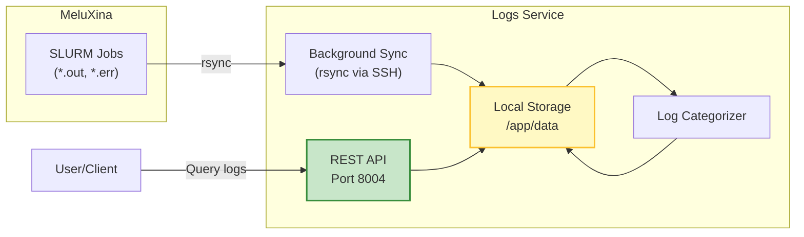

# Logs Service

## Overview

The Logs Service provides centralized log collection and management for all SLURM jobs running on MeluXina. It automatically syncs logs from the HPC cluster, categorizes them by service type, and exposes them via REST API.

!!! tip "Live API Explorer"
    The best way to explore the API is here:
    
    **[Open Interactive API Docs](../../api/logs){ .md-button .md-button--primary }**

## What It Does

- **Automatic Sync**: Periodically syncs logs from MeluXina to local storage
- **Categorization**: Organizes logs by service type (server, client, vllm, vector-db, etc.)
- **REST API**: Query and retrieve logs via HTTP endpoints
- **Statistics**: Provides file counts and size metrics per service
- **Manual Triggers**: Force immediate sync via API

## Architecture



## Key Features

### Automatic Categorization

Logs are automatically categorized into:

- **server**: Service orchestrator logs
- **client**: Load generator logs (loadgen-*.out/err)
- **vllm**: vLLM inference service logs
- **vector-db**: Vector database logs (Qdrant, etc.)
- **monitoring**: Prometheus exporter logs
- **uncategorized**: Unrecognized log files

### Periodic Sync

The service runs a background task that:

1. Syncs logs from `~/ai-factory-benchmarks/logs/` on MeluXina
2. Categorizes them by pattern matching
3. Updates statistics
4. Repeats every N seconds (configurable via `SYNC_INTERVAL`)

## Usage Examples

### List All Services

```bash
curl http://localhost:8004/services
```

**Response:**
```json
["server", "client", "vllm", "vector-db", "monitoring", "uncategorized"]
```

### Get Service Statistics

```bash
curl http://localhost:8004/services/stats
```

**Response:**
```json
{
  "client": {
    "service": "client",
    "file_count": 24,
    "total_size_bytes": 1048576,
    "latest_modified": "2024-11-25T15:30:00"
  },
  "vllm": {
    "service": "vllm",
    "file_count": 8,
    "total_size_bytes": 524288,
    "latest_modified": "2024-11-25T15:25:00"
  }
}
```

### List Logs for a Service

```bash
# Get all client logs
curl "http://localhost:8004/logs?service=client&limit=10"
```

**Response:**
```json
[
  {
    "filename": "loadgen-12345.out",
    "path": "categorized/client/loadgen-12345.out",
    "size_bytes": 45632,
    "modified_time": "2024-11-25T15:30:00",
    "service": "client"
  }
]
```

### Get Log Content

```bash
# Get last 100 lines of a log file
curl "http://localhost:8004/logs/content?path=categorized/client/loadgen-12345.out&tail=100"
```

### Trigger Manual Sync

```bash
curl -X POST http://localhost:8004/sync/trigger
```

**Response:**
```json
{
  "status": "success",
  "message": "Log sync completed",
  "categories": {
    "client": 5,
    "vllm": 2,
    "uncategorized": 1
  }
}
```

### Delete Logs

```bash
# Delete specific log file
curl -X POST "http://localhost:8004/logs/delete?path=categorized/client/loadgen-12345.out"

# Delete all logs (cleanup)
curl -X POST http://localhost:8004/logs/cleanup
```

## Configuration

Environment variables:

- `SYNC_INTERVAL`: Seconds between syncs (default: 60)
- `REMOTE_BASE_PATH`: Base path on MeluXina (default: ~/ai-factory-benchmarks)
- `SSH_HOST`, `SSH_USER`, `SSH_PORT`: SSH connection details
- `LOG_LEVEL`: Logging verbosity (default: INFO)

## API Reference

See [Logs API Documentation](../api/logs.md) for complete endpoint documentation.
