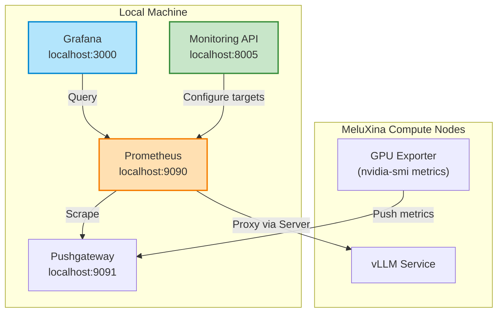

# Monitoring Service

## Overview

The Monitoring Service collects and aggregates performance metrics from deployed AI services and the HPC infrastructure. It integrates with Prometheus, Pushgateway, and Grafana to provide real-time visibility into GPU utilization, power consumption, and service health.

!!! tip "Live API Explorer"
    The best way to explore the API is here:
    
    **[Open Interactive API Docs](../../api/monitoring){ .md-button .md-button--primary }**

## What It Does

- **Metrics Collection**: Gathers GPU metrics (utilization, memory, power, temperature) from compute nodes
- **Pushgateway Integration**: Buffers metrics when direct scraping isn't possible (network isolation)
- **Target Registration**: Dynamically registers services and exporters for Prometheus scraping
- **Session Management**: Create monitoring sessions with configurable time windows
- **Artifact Generation**: Export collected metrics as CSV/JSON for analysis

## Architecture

## API Reference

See [Monitoring API Documentation](../api/monitoring.md) for the interactive API reference.
