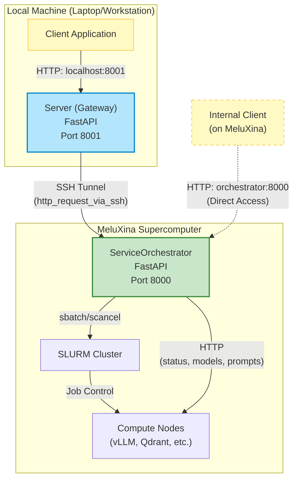
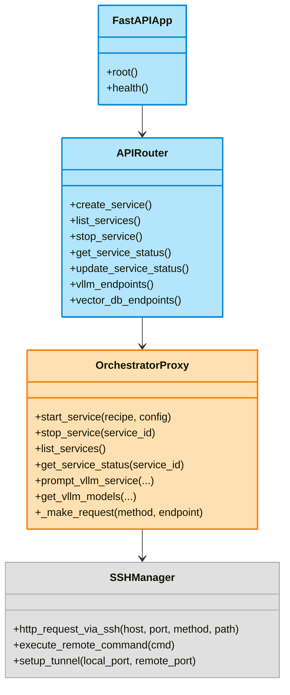
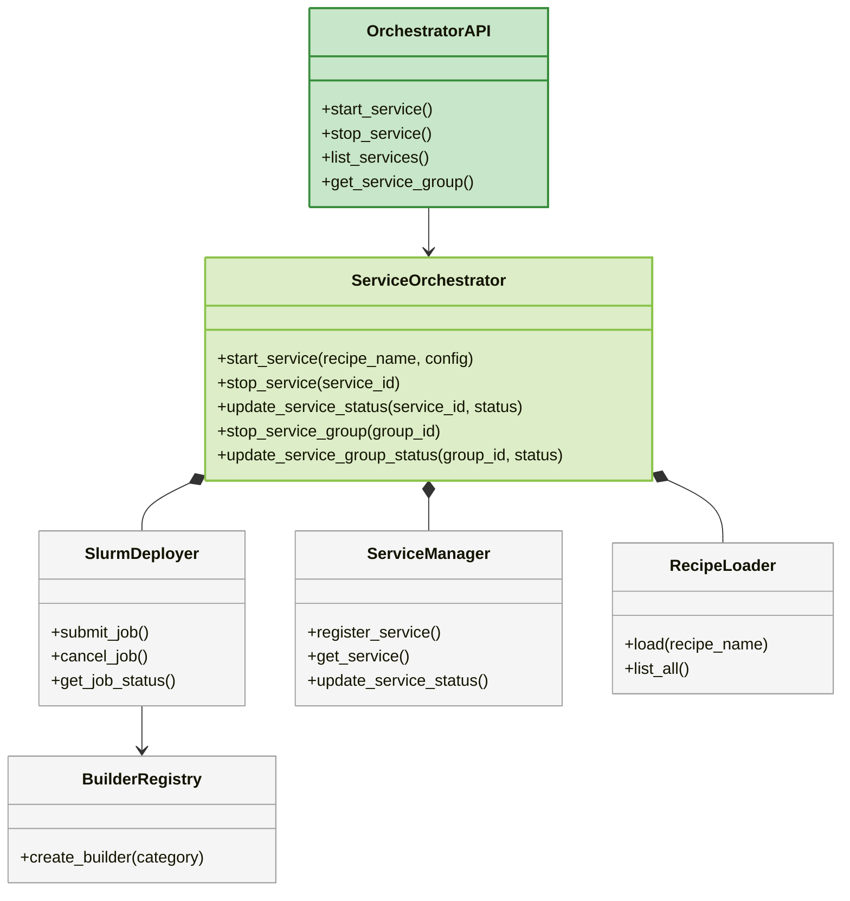
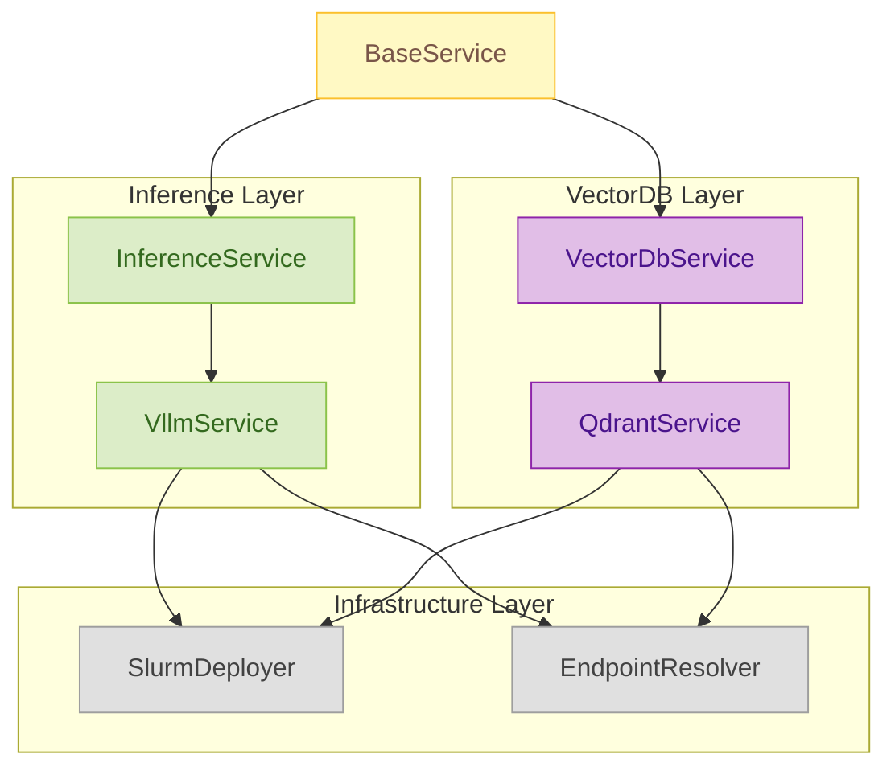
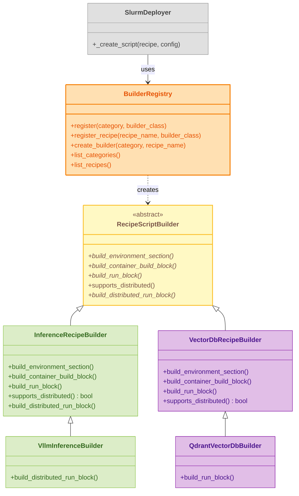

# Server API Reference

The Server Service provides REST API for managing AI services on the MeluXina supercomputer.

## Interactive API Documentation

!!! tip "Live API Explorer"
    The best way to explore the API is here:
    
    **[Open Interactive API Docs](../../api/server){ .md-button .md-button--primary }**

## Overview

A FastAPI gateway server that proxies AI workload orchestration requests to a ServiceOrchestrator running on MeluXina.

### Architecture

The system consists of two main components:

1. **Server (Gateway)**: Runs locally (e.g., laptop/workstation), exposes REST API, forwards requests via SSH
2. **ServiceOrchestrator**: Runs on MeluXina, manages SLURM jobs, handles container deployment

### What it does

- **API Gateway**: Provides a stable REST API endpoint for external clients
- **Request Proxying**: Forwards all orchestration requests to the ServiceOrchestrator via SSH tunnels
- **Dual Access Pattern**: 
  - **External clients** → Server (localhost:8001) → SSH tunnel → Orchestrator (MeluXina)
  - **Internal clients** (on MeluXina) → Orchestrator API directly (orchestrator:8000)


### Deployment Architecture

The system is split across two locations with clear separation of concerns:



**Key Points:**

- **Server (Gateway)**: Lightweight proxy running locally, provides stable API endpoint
- **ServiceOrchestrator**: Heavy lifting component on MeluXina, manages SLURM and containers
- **SSH Tunnel**: Secure communication channel between server and orchestrator
- **Dual Access**: External clients use the gateway; internal MeluXina clients can bypass it

### Server (Gateway) Components

The server component focuses on request proxying and client-facing API:



**Server Layer Responsibilities:**

- Expose REST API on `localhost:8001` for external clients
- Parse and validate client requests
- Forward requests to orchestrator via SSH tunnels
- Handle SSH connection failures gracefully
- Return normalized responses to clients

### ServiceOrchestrator Components (on MeluXina)

The orchestrator handles all the heavy lifting:



**Orchestrator Layer Responsibilities:**

- Expose internal API on `orchestrator:8000` (accessible from MeluXina network)
- Load and parse recipe YAML files
- Generate SLURM job scripts with appropriate resource allocations
- Submit jobs to SLURM via `sbatch`
- Track service lifecycle (pending → configuring → running → cancelled)
- Resolve compute node endpoints for running services
- Query service health and models from compute nodes
- Handle service groups (replica sets) and load balancing

### Service Handlers & Types



The service-handlers diagram explains how domain-specific functionality is organized:

- `BaseService` provides the shared plumbing (deployer access, service registry, endpoint resolution) used by concrete handlers.
- `InferenceService` and `VectorDbService` define the operations expected by their domains; `VllmService` and `QdrantService` implement those operations against running jobs.
- These handlers consult `SlurmDeployer` for live job state and `EndpointResolver` to discover the compute-node HTTP endpoints used to reach the actual running services.

Refer to this diagram when extending the system with a new service type (create a subclass of `BaseService` and implement the domain-specific API surface).

## How Recipe YAML Files Work

Recipe YAML files define service configurations that are loaded and used to generate SLURM job scripts for deploying services on the cluster.

### Recipe Loading Flow

```
User Request → RecipeLoader.load(recipe_name) → YAML File Read → Recipe Object → SlurmDeployer
                                                                                         ↓
BuilderRegistry.create_builder() → RecipeScriptBuilder → Generated SLURM Script → sbatch
```

### Recipe YAML Structure

Each recipe YAML file contains:

| Section | Purpose |
|---------|---------|
| `name` | Recipe identifier (e.g., `vllm`) |
| `category` | Service type: `inference`, `vector-db`, or `storage` |
| `description` | Human-readable service description |
| `image` | Singularity/Apptainer image filename (built from `.def`) |
| `container_def` | Singularity definition file for building the image |
| `ports` | Default ports the service exposes |
| `environment` | Environment variables passed to the container |
| `resources` | Default SLURM resource requests (can be overridden per job) |
| `distributed` | Configuration for multi-node/multi-GPU execution |
| `replicas` | Number of independent service instances for data parallelism (optional) |

### Example: vLLM Recipe

```yaml
name: vllm-single-node
category: inference
description: "vLLM high-performance inference server for large language models"
version: "0.2.0"
image: "vllm.sif"
container_def: "vllm.def"

ports:
  - 8001

environment:
  VLLM_HOST: "0.0.0.0"
  VLLM_PORT: "8001"
  VLLM_MODEL: "Qwen/Qwen2.5-0.5B-Instruct"
  VLLM_WORKDIR: "/workspace"
  VLLM_LOGGING_LEVEL: "INFO"
  VLLM_TENSOR_PARALLEL_SIZE: "4" 

resources:
  nodes: "1"
  cpu: "2"
  memory: "32G"
  time_limit: 15
  gpu: "4"
```

### Multi-Replica Configuration

The `vllm-replicas` recipe creates multiple replicas on a single node for high-throughput inference:

```yaml
name: vllm-replicas
category: inference
description: "vLLM with multiple replicas - flexible GPU allocation per replica"

environment:
  VLLM_HOST: "0.0.0.0"
  VLLM_MODEL: "Qwen/Qwen2.5-0.5B-Instruct"
  # ... other settings ...

resources:  # Per node (not per replica)
  nodes: "1"  # Number of nodes to allocate
  cpu: "8"    # CPUs per node
  memory: "64G"  # Memory per node
  time_limit: 15
  gpu: "4"    # Total GPUs per node

# Replica group configuration
# System calculates: replicas_per_node = gpu / gpu_per_replica
gpu_per_replica: 1  # Each replica uses 1 GPU (data parallel)
base_port: 8001     # First replica uses 8001, second uses 8002, etc.
```

**How it works:**
- With `gpu: 4` and `gpu_per_replica: 1`, you get 4 replicas
- Each replica runs independently on separate GPUs (0, 1, 2, 3)
- Replicas listen on consecutive ports (8001, 8002, 8003, 8004)
- All replicas run in a single SLURM job
- Load balancing distributes requests using round-robin with automatic failover

### How Recipes Are Used

1. **Service Creation**: User calls `/api/v1/services` with `recipe_name: "inference/vllm-single-node"`
2. **Recipe Loading**: `RecipeLoader` reads `recipes/inference/vllm-single-node.yaml`
3. **Configuration Merge**: User-provided config (e.g., `gpu: 8`) overrides recipe defaults
4. **Replica Detection**: If `gpu_per_replica` field is present, calculate replicas per node
5. **Builder Selection**: `BuilderRegistry` selects recipe-specific builder or category default
6. **Script Generation**: Builder generates SLURM script with replica configuration
7. **Job Submission**: Submit single SLURM job that launches all replicas on assigned GPUs

### Recipe-Specific Builders

Some recipes have custom builders that override script generation behavior. For example:

- **`VllmInferenceBuilder`**: Overrides `build_distributed_run_block()` to add tensor parallelism with `torchrun`
- **`QdrantVectorDbBuilder`**: Overrides `build_run_block()` to mount job-specific storage paths

This allows recipes to customize script generation without modifying the core `SlurmDeployer`.

### Recipe Script Builders (Orchestrator Component)

The following diagram shows the Recipe Builder architecture **running on the ServiceOrchestrator** (MeluXina side). It uses the Strategy pattern to generate SLURM job scripts for different recipe types. This modular design allows adding new services without modifying the core SLURM deployer.




## Further Reading

- [Service Recipes](recipes.md) - Available service templates
- [Architecture](../architecture/overview.md) - System design
- [Development Guide](../development/guidelines.md) - API development

---
