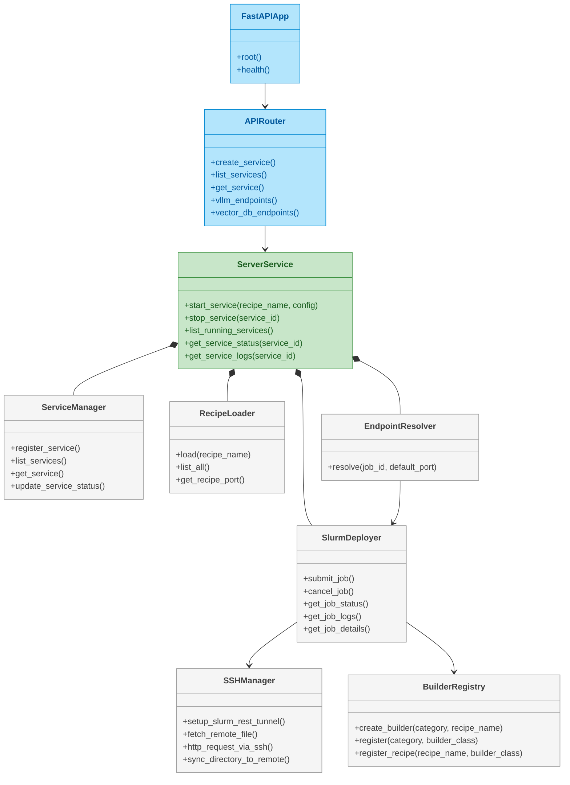
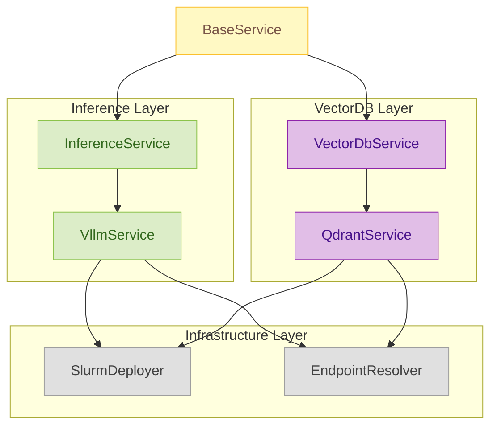
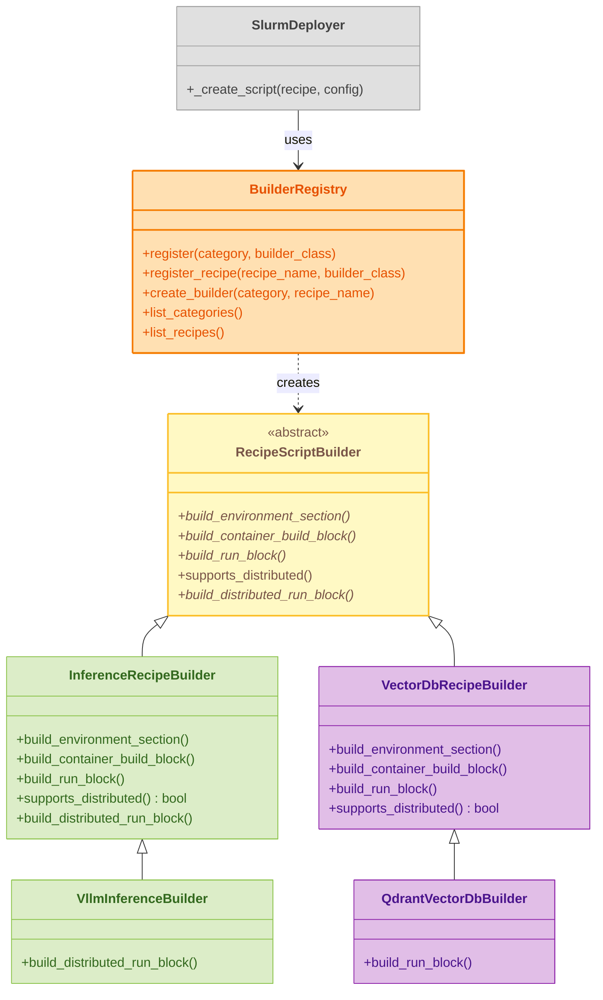

# Server API Reference

The Server Service provides REST API for managing AI services on the MeluXina supercomputer.

## Interactive API Documentation

!!! tip "Live API Explorer"
    The best way to explore the API is here:
    
    **[Open Interactive API Docs](../../api/server){ .md-button .md-button--primary }**

## Overview

A FastAPI server for orchestrating AI workloads on SLURM clusters using Apptainer containers.

### What it does

- **Service Orchestration**: Deploy and manage AI services via SLURM job submission
- **Recipe System**: Pre-defined configurations for common AI workloads
- **REST API**: Operations for service lifecycle management


### Orchestration & Infrastructure

The following class diagram describes the major components in the `services/server` microservice and how they relate to each other (FastAPI routing, orchestration, SLURM interaction, SSH, recipe loading and service-specific handlers).



The orchestration diagram above groups the primary infrastructure and control-path responsibilities:

- FastAPI exposes HTTP endpoints; the router maps requests to the server-layer.
- ServerService is the central coordinator: it submits jobs using SlurmDeployer, keeps service records in ServiceManager, loads recipes via RecipeLoader, and computes endpoints via EndpointResolver.
- SlurmDeployer is responsible for job lifecycle (submit/cancel/status) and relies on SSHManager for remote operations (tunnels, fetching logs, proxy HTTP calls to compute nodes) and BuilderRegistry for recipe-specific script generation.

When tracing a "create service" request, follow the path: FastAPIApp -> APIRouter -> ServerService -> SlurmDeployer (+ SSHManager + BuilderRegistry). Endpoint resolution happens later via EndpointResolver which queries SLURM job details and recipe metadata.

### Service Handlers & Types



The service-handlers diagram explains how domain-specific functionality is organized:

- `BaseService` provides the shared plumbing (deployer access, service registry, endpoint resolution) used by concrete handlers.
- `InferenceService` and `VectorDbService` define the operations expected by their domains; `VllmService` and `QdrantService` implement those operations against running jobs.
- These handlers consult `SlurmDeployer` for live job state and `EndpointResolver` to discover the compute-node HTTP endpoints used to reach the actual running services.

Refer to this diagram when extending the system with a new service type (create a subclass of `BaseService` and implement the domain-specific API surface).

## How Recipe YAML Files Work

Recipe YAML files define service configurations that are loaded and used to generate SLURM job scripts for deploying services on the cluster.

### Recipe Loading Flow

```
User Request → RecipeLoader.load(recipe_name) → YAML File Read → Recipe Object → SlurmDeployer
                                                                                         ↓
BuilderRegistry.create_builder() → RecipeScriptBuilder → Generated SLURM Script → sbatch
```

### Recipe YAML Structure

Each recipe YAML file contains:

| Section | Purpose |
|---------|---------|
| `name` | Recipe identifier (e.g., `vllm`) |
| `category` | Service type: `inference`, `vector-db`, or `storage` |
| `description` | Human-readable service description |
| `image` | Singularity/Apptainer image filename (built from `.def`) |
| `container_def` | Singularity definition file for building the image |
| `ports` | Default ports the service exposes |
| `environment` | Environment variables passed to the container |
| `resources` | Default SLURM resource requests (can be overridden per job) |
| `distributed` | Configuration for multi-node/multi-GPU execution |

### Example: vLLM Recipe

```yaml
name: vllm
category: inference
description: "vLLM high-performance inference server for large language models"
version: "0.2.0"
image: "vllm.sif"
container_def: "vllm.def"

ports:
  - 8001

environment:
  VLLM_HOST: "0.0.0.0"
  VLLM_PORT: "8001"
  VLLM_MODEL: "Qwen/Qwen2.5-0.5B-Instruct"
  VLLM_WORKDIR: "/workspace"
  VLLM_LOGGING_LEVEL: "INFO"

resources:
  nodes: "1"
  cpu: "2"
  memory: "32G"
  time_limit: 15
  gpu: "1"

distributed:
  nproc_per_node: 1        # Processes per node (e.g., GPUs)
  master_port: 29500       # Rendezvous port for distributed setup
  rdzv_backend: c10d       # PyTorch distributed backend
```

### How Recipes Are Used

1. **Service Creation**: User calls `/api/v1/services` with `recipe_name: "inference/vllm"`
2. **Recipe Loading**: `RecipeLoader` reads `recipes/inference/vllm.yaml`
3. **Configuration Merge**: User-provided config (e.g., `nodes: 2`) overrides recipe defaults
4. **Builder Selection**: `BuilderRegistry` selects `VllmInferenceBuilder` (recipe-specific) or falls back to `InferenceRecipeBuilder` (category default)
5. **Script Generation**: Builder generates SLURM script using recipe metadata and merged config
6. **Job Submission**: Script is submitted via `sbatch` to SLURM

### Recipe-Specific Builders

Some recipes have custom builders that override script generation behavior. For example:

- **`VllmInferenceBuilder`**: Overrides `build_distributed_run_block()` to add tensor parallelism with `torchrun`
- **`QdrantVectorDbBuilder`**: Overrides `build_run_block()` to mount job-specific storage paths

This allows recipes to customize script generation without modifying the core `SlurmDeployer`.

### Recipe Script Builders

The following diagram shows the Recipe Builder architecture, which uses the Strategy pattern to generate SLURM job scripts for different recipe types. This modular design allows adding new services without modifying the core SLURM deployer.




## Further Reading

- [Service Recipes](recipes.md) - Available service templates
- [Architecture](../architecture/overview.md) - System design
- [Development Guide](../development/guidelines.md) - API development

---
