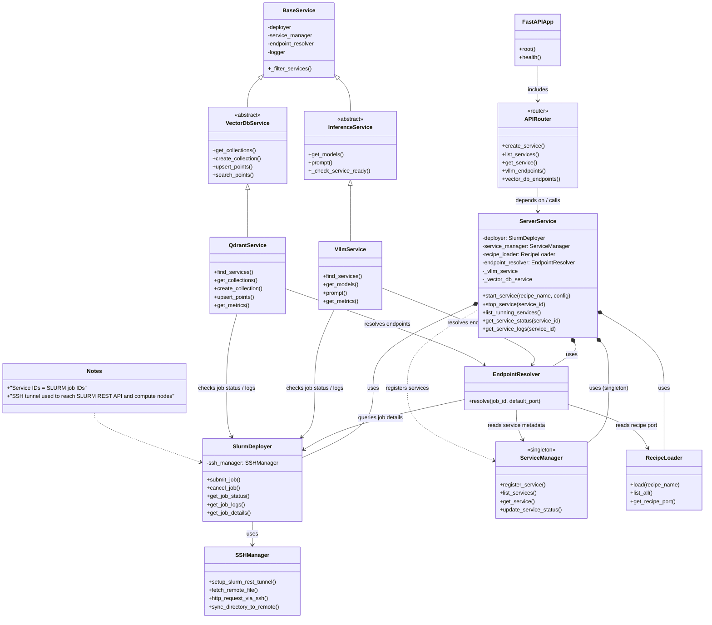

# Server API Reference

The Server Service provides REST API for managing AI services on the MeluXina supercomputer.

## Interactive API Documentation

!!! tip "Live API Explorer"
    The best way to explore the API is here:
    
    **[Open Interactive API Docs](../../api/server){ .md-button .md-button--primary }**

## Overview

A FastAPI server for orchestrating AI workloads on SLURM clusters using Apptainer containers.

### What it does

- **Service Orchestration**: Deploy and manage AI services via SLURM job submission
- **Recipe System**: Pre-defined configurations for common AI workloads
- **VLLM Integration**: Direct API access to running VLLM inference services
- **REST API**: Operations for service lifecycle management

### Architecture

```
┌─────────────────────────────────────┐
│  Local Laptop (Docker)              │
│  ┌────────────────────────────────┐ │
│  │  FastAPI Server Container      │ │
│  │  - API endpoints               │ │
│  │  - Hot-reload on code changes  │ │
│  │  - SLURM client (via SSH)      │ │
│  └────────────────────────────────┘ │
│           │ SSH Tunnel               │
└───────────┼─────────────────────────┘
            │
            ▼
┌─────────────────────────────────────┐
│  MeluXina HPC Cluster               │
│  ┌────────────────────────────────┐ │
│  │  SLURM Job Submission          │ │
│  │  Apptainer containers          │ │
│  │  GPU nodes                     │ │
│  └────────────────────────────────┘ │
└─────────────────────────────────────┘
```

The following class diagram describes the major components in the `services/server` microservice and how they relate to each other (FastAPI routing, orchestration, SLURM interaction, SSH, recipe loading and service-specific handlers).



### Legend & Rendering

- Solid arrow (A --> B): A calls or depends on B
- Composition (A *-- B): A composes/owns B instance
- Inheritance (A <|-- B): B extends A

To render this diagram in the docs site ensure the MkDocs configuration (or your viewer) supports Mermaid diagrams (mkdocs-mermaid2-plugin or built-in Mermaid support in MkDocs Material). The diagram can be previewed in editors that support Mermaid or on GitHub when Mermaid rendering is enabled.


## Further Reading

- [Service Recipes](recipes.md) - Available service templates
- [Architecture](../architecture/overview.md) - System design
- [Development Guide](../development/guidelines.md) - API development

---
