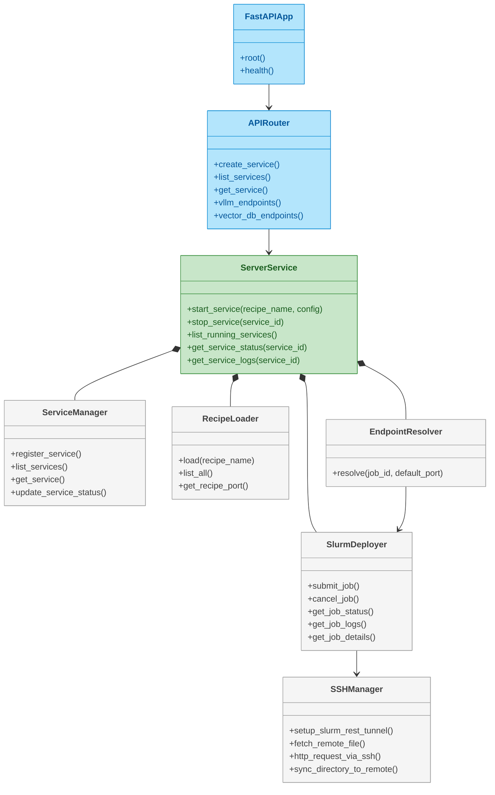
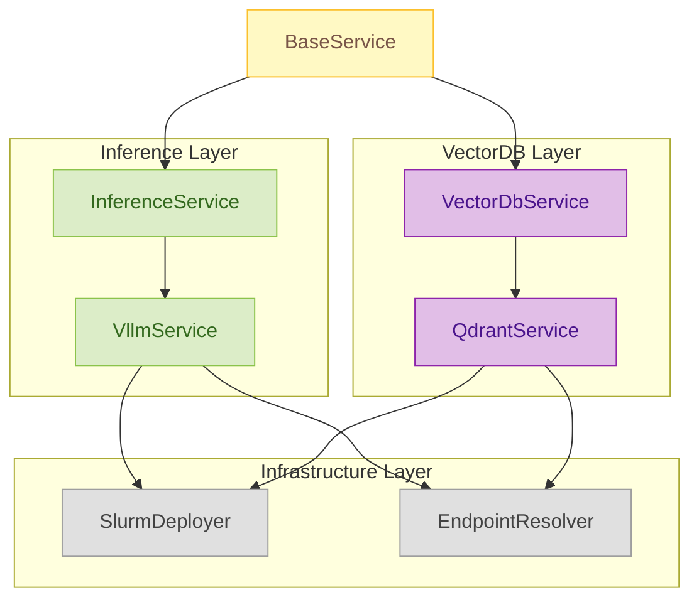

# Server API Reference

The Server Service provides REST API for managing AI services on the MeluXina supercomputer.

## Interactive API Documentation

!!! tip "Live API Explorer"
    The best way to explore the API is here:
    
    **[Open Interactive API Docs](../../api/server){ .md-button .md-button--primary }**

## Overview

A FastAPI server for orchestrating AI workloads on SLURM clusters using Apptainer containers.

### What it does

- **Service Orchestration**: Deploy and manage AI services via SLURM job submission
- **Recipe System**: Pre-defined configurations for common AI workloads
- **REST API**: Operations for service lifecycle management

### Orchestration & Infrastructure

The following class diagram describes the major components in the `services/server` microservice and how they relate to each other (FastAPI routing, orchestration, SLURM interaction, SSH, recipe loading and service-specific handlers).

The orchestration diagram above groups the primary infrastructure and control-path responsibilities:

- FastAPI exposes HTTP endpoints; the router maps requests to the server-layer.
- ServerService is the central coordinator: it submits jobs using SlurmDeployer, keeps service records in ServiceManager, loads recipes via RecipeLoader, and computes endpoints via EndpointResolver.
- SlurmDeployer is responsible for job lifecycle (submit/cancel/status) and relies on SSHManager for remote operations (tunnels, fetching logs, proxy HTTP calls to compute nodes).

When tracing a "create service" request, follow the path: FastAPIApp -> APIRouter -> ServerService -> SlurmDeployer (+ SSHManager). Endpoint resolution happens later via EndpointResolver which queries SLURM job details and recipe metadata.

### Service Handlers & Types

## Further Reading

The service-handlers diagram explains how domain-specific functionality is organized:

- `BaseService` provides the shared plumbing (deployer access, service registry, endpoint resolution) used by concrete handlers.
- `InferenceService` and `VectorDbService` define the operations expected by their domains; `VllmService` and `QdrantService` implement those operations against running jobs.
- These handlers consult `SlurmDeployer` for live job state and `EndpointResolver` to discover the compute-node HTTP endpoints used to reach the actual running services.

Refer to this diagram when extending the system with a new service type (create a subclass of `BaseService` and implement the domain-specific API surface).

## Further Reading

- [Service Recipes](recipes.md) - Available service templates
- [Architecture](../architecture/overview.md) - System design
- [Development Guide](../development/guidelines.md) - API development

---
