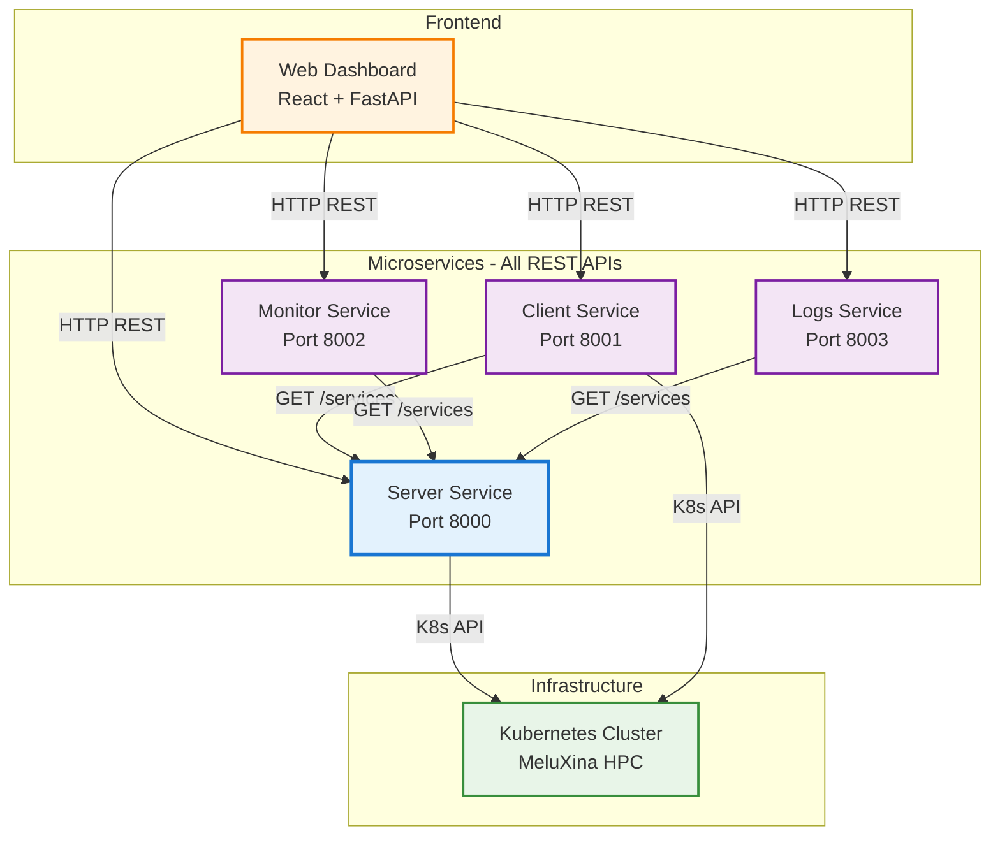

# Architecture Diagrams 

## End-user Experience Flow
1. User opens web dashboard in browser
2. User selects "Start New Benchmark Experiment"
3. User chooses:
   - AI Service: "vLLM Inference" 
   - Nodes: 4
   - Test Type: "Throughput Test"
   - Duration: 10 minutes
4. User clicks "Start"

Behind the scenes:
-> Web UI -> Server Service (deploy vLLM on 4 nodes)
-> Web UI -> Client Service (generate load against vLLM)  
-> Web UI -> Monitor Service (collect metrics)
-> Web UI -> Logs Service (capture logs)

5. User sees real-time dashboard with:
   - Service status
   - Performance graphs
   - Live metrics
   - Log streams

## Microservices Architecture
The end-user will have access to the UI on which his actions will trigger RESTs (via FastAPI backend) to the services we implemented, which will then deploy K8s pods. 

