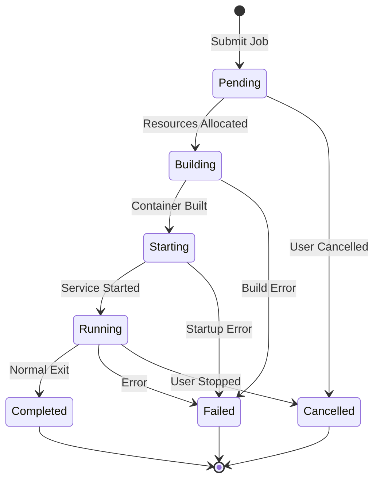

# Container Orchestration

## Overview

This system provides **Kubernetes-like container orchestration** for the Meluxina HPC environment using **Apptainer + SLURM**. You get all the benefits of K8s-style deployments without needing an actual Kubernetes cluster.

## Why Not Traditional Kubernetes?

HPC environments like MeluXina have specific requirements:

- **SLURM Integration** - Native job scheduling
- **GPU Management** - Direct GPU access without virtualization overhead
- **MPI Support** - High-performance parallel computing
- **Security** - User-space containers (Apptainer) instead of Docker
- **Performance** - No container runtime overhead

## Architecture

### Hybrid Deployment Model

```
External K8s/Docker Environment    │    Meluxina HPC Cluster
(Your laptop/cloud/server)        │    (SLURM + Apptainer)
                                  │
┌─────────────────────────────────┼─────────────────────────────┐
│ 🐳 Docker Compose/K8s          │    🖥️  Login Nodes          │
│                                │                             │
│ ┌─────────────────────────────┐ │    ┌─────────────────────┐  │
│ │ Server Service (8001)       │ │    │ SLURM Jobs          │  │
│ │ - FastAPI                   │◄┼────┤ - vLLM containers   │  │
│ │ - Recipe management         │ │    │ - Apptainer workloads│  │
│ │ - SLURM REST API calls      │ │    │ - GPU computations  │  │
│ └─────────────────────────────┘ │    └─────────────────────┘  │
│                                │                             │
│ ┌─────────────────────────────┐ │    ┌─────────────────────┐  │
│ │ Client Service (8002)       │ │    │ Compute Nodes       │  │
│ │ - Benchmark execution       │◄┼────┤ - A100 GPUs         │  │
│ │ - Result collection         │ │    │ - AI model inference│  │
│ └─────────────────────────────┘ │    └─────────────────────┘  │
│                                │                             │
│ ┌─────────────────────────────┐ │                             │
│ │ Monitoring Service (8003)   │ │                             │
│ │ - Metrics collection        │ │                             │
│ │ - SLURM status monitoring   │ │                             │
│ └─────────────────────────────┘ │                             │
│                                │                             │
│ ┌─────────────────────────────┐ │                             │
│ │ Logs Service (8004)         │ │                             │
│ │ - Log aggregation          │ │                             │
│ │ - SLURM log collection      │ │                             │
│ └─────────────────────────────┘ │                             │
└─────────────────────────────────┴─────────────────────────────┘
```

## Features

✅ **K8s-style YAML deployments**  
✅ **Container orchestration via SLURM**  
✅ **Service discovery and networking**  
✅ **Scaling and lifecycle management**  
✅ **Multi-container pod deployments**  
✅ **Dependency management**  

## Recipe-Based Deployment

Instead of Kubernetes YAML, we use **recipes** - YAML templates for services:

### Recipe Structure

```yaml
name: vllm
description: vLLM Inference Service

container:
  definition: vllm.def
  image: vllm.sif

resources:
  nodes: 1
  cpu: 8
  memory: 32G
  gpu: 1
  time_limit: 60

environment:
  VLLM_MODEL: Qwen/Qwen2.5-0.5B-Instruct
  VLLM_MAX_MODEL_LEN: 2048
  VLLM_GPU_MEMORY_UTILIZATION: 0.9

ports:
  - 8000

slurm:
  partition: gpu
  qos: default
  account: p200981
```

### Container Definition (Apptainer)

```dockerfile
Bootstrap: docker
From: vllm/vllm-openai:latest

%post
    pip install --no-cache-dir vllm

%environment
    export VLLM_API_PORT=8000

%runscript
    python -m vllm.entrypoints.openai.api_server \
        --model ${VLLM_MODEL} \
        --host 0.0.0.0 \
        --port ${VLLM_API_PORT}
```

## Deployment Workflow

### 1. Build Container Image

```bash
cd services/server/src/recipes/inference

# Build Apptainer image from definition
apptainer build vllm.sif vllm.def
```

### 2. Deploy via API

```bash
curl -X POST "http://server:8001/api/v1/services" \
  -H "Content-Type: application/json" \
  -d '{
    "recipe_name": "inference/vllm",
    "config": {
      "environment": {
        "VLLM_MODEL": "gpt2"
      },
      "resources": {
        "gpu": "1",
        "memory": "32G"
      }
    }
  }'
```

### 3. Monitor Deployment

```bash
# Check service status
curl "http://server:8001/api/v1/services/{job_id}/status"

# View logs
curl "http://server:8001/api/v1/services/{job_id}/logs"
```

## SLURM Integration

### Job Submission

The Server Service translates recipes into SLURM batch scripts:

```bash
#!/bin/bash
#SBATCH --job-name=vllm-3614523
#SBATCH --nodes=1
#SBATCH --ntasks-per-node=1
#SBATCH --cpus-per-task=8
#SBATCH --mem=32G
#SBATCH --gres=gpu:1
#SBATCH --time=01:00:00
#SBATCH --partition=gpu
#SBATCH --account=p200981

# Load modules
module load Apptainer/1.2.4-GCCcore-12.3.0

# Set environment variables
export VLLM_MODEL="gpt2"
export SLURM_JWT="${SLURM_JWT}"

# Run container
apptainer run \
    --nv \
    --env VLLM_MODEL="${VLLM_MODEL}" \
    --bind /home/users/${USER} \
    vllm.sif
```

### Job Lifecycle



## Service Discovery

### Network Communication

Services communicate via hostnames assigned by SLURM:

```python
# Get service endpoint from SLURM job
job_info = get_slurm_job_info(job_id)
hostname = job_info['node_list'][0]  # e.g., "mel2106"
port = 8000

endpoint = f"http://{hostname}:{port}"
```

### Environment Variables

Services receive configuration via environment variables:

```bash
# Passed to container
SLURM_JOB_ID=3614523
SLURM_JOB_NAME=vllm-3614523
SLURM_NODELIST=mel2106
VLLM_MODEL=gpt2
SERVER_BASE_PATH=/home/users/u103056/server
```

## Scaling

### Horizontal Scaling

Deploy multiple instances:

```bash
# Deploy 3 vLLM instances
for i in {1..3}; do
  curl -X POST "http://server:8001/api/v1/services" \
    -d '{"recipe_name": "inference/vllm"}'
done
```

### Job Arrays (Future)

SLURM job arrays for parallel deployments:

```bash
#SBATCH --array=1-10
```

## Resource Management

### GPU Allocation

```yaml
resources:
  gpu: 1              # Request 1 GPU
  gpu_type: a100      # Specific GPU type
```

Translates to SLURM:
```bash
#SBATCH --gres=gpu:a100:1
```

### CPU Pinning

```yaml
resources:
  cpu: 8
  cpu_bind: cores     # Bind to physical cores
```

### Memory Management

```yaml
resources:
  memory: 32G         # Total memory
  memory_per_cpu: 4G  # Or per-CPU allocation
```

## Benefits over Traditional K8s

🎯 **HPC Optimized**: Designed for SLURM-based HPC environments  
🎯 **No K8s Overhead**: Lighter weight than full Kubernetes  
🎯 **GPU Ready**: Native Apptainer GPU support with `--nv`  
🎯 **MPI Support**: Seamless MPI application integration  
🎯 **Familiar API**: K8s-style deployments and management  
🎯 **Security**: User-space containers (no root required)  
🎯 **Performance**: Direct hardware access, minimal overhead  

## Container vs. Bare Metal

| Feature | Container (Apptainer) | Bare Metal |
|---------|----------------------|------------|
| Isolation | ✅ Yes | ❌ No |
| Reproducibility | ✅ High | ⚠️ Variable |
| Dependency Management | ✅ Easy | ⚠️ Complex |
| GPU Access | ✅ Direct (`--nv`) | ✅ Direct |
| Network Performance | ✅ Native | ✅ Native |
| Setup Time | ⚠️ Build once | ⚠️ Per-node |
| Portability | ✅ High | ❌ Low |

## Best Practices

### 1. Container Image Management

```bash
# Store images in shared filesystem
/project/shared/containers/
├── vllm.sif
├── postgres.sif
└── minio.sif
```

### 2. Recipe Organization

```bash
services/server/src/recipes/
├── inference/
│   ├── vllm.yaml
│   ├── vllm.def
│   └── vllm.sif
├── storage/
│   ├── postgres.yaml
│   └── minio.yaml
└── vector-db/
    ├── chroma.yaml
    └── faiss.yaml
```

### 3. Environment Management

Use recipe defaults, override as needed:

```json
{
  "recipe_name": "inference/vllm",
  "config": {
    "environment": {
      "VLLM_MODEL": "custom-model"  // Override default
    }
  }
}
```

## Troubleshooting

### Container Build Fails

```bash
# Use --fakeroot for rootless builds
apptainer build --fakeroot vllm.sif vllm.def

# Check build logs
apptainer build --debug vllm.sif vllm.def
```

### Job Stays Pending

```bash
# Check queue
squeue -u $USER

# Check available resources
sinfo -p gpu

# View detailed job info
scontrol show job <job_id>
```

### Container Won't Start

```bash
# Test container manually
apptainer exec vllm.sif python --version

# Run with debug output
apptainer run --debug vllm.sif
```

## Example: Complete Deployment

```bash
# 1. Build container
cd services/server/src/recipes/inference
apptainer build vllm.sif vllm.def

# 2. Start server
cd ../../..
./launch_server.sh

# 3. Deploy service
curl -X POST "http://mel2106:8001/api/v1/services" \
  -H "Content-Type: application/json" \
  -d '{
    "recipe_name": "inference/vllm",
    "config": {
      "environment": {"VLLM_MODEL": "gpt2"},
      "resources": {"gpu": "1", "memory": "32G"}
    }
  }'

# 4. Monitor until running
watch -n 5 'curl -s http://mel2106:8001/api/v1/services/3614523/status'

# 5. Use service
curl -X POST "http://mel2106:8001/api/v1/vllm/3614523/prompt" \
  -d '{"prompt": "Hello, AI!"}'
```

## Future Enhancements

- ⏳ Multi-container pods
- ⏳ Service mesh integration
- ⏳ Auto-scaling based on load
- ⏳ Volume management
- ⏳ ConfigMaps and Secrets

---

**Next**: [Microservices Architecture](microservices.md) | [System Overview](overview.md)
