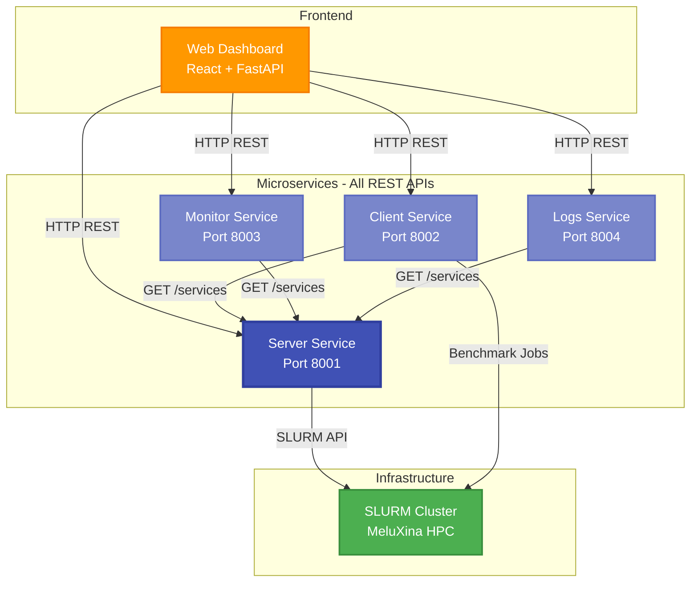
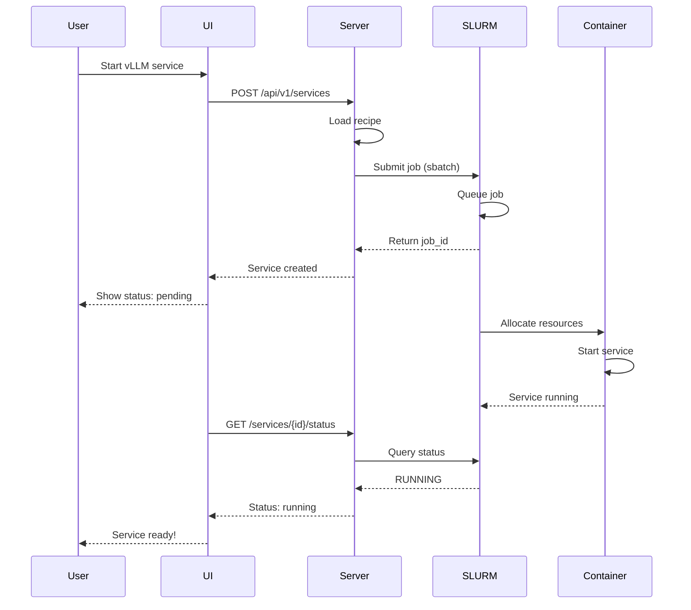
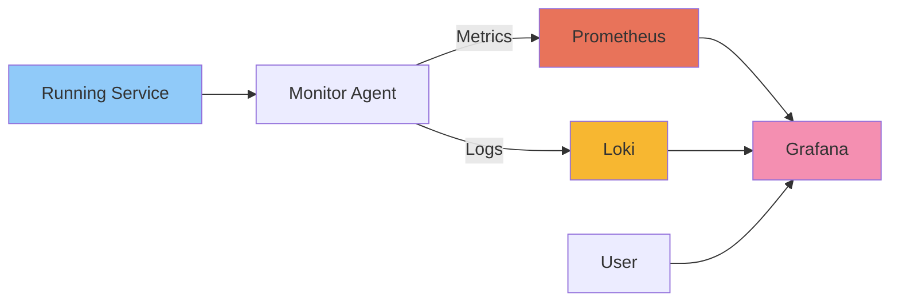

# Microservices Architecture

## End-user Experience Flow

1. User opens web dashboard in browser
2. User selects "Start New Benchmark Experiment"
3. User chooses:
   - AI Service: "vLLM Inference" 
   - Nodes: 4
   - Test Type: "Throughput Test"
   - Duration: 10 minutes
4. User clicks "Start"

Behind the scenes:
- Web UI → Server Service (deploy vLLM on 4 nodes)
- Web UI → Client Service (generate load against vLLM)  
- Web UI → Monitor Service (collect metrics)
- Web UI → Logs Service (capture logs)

5. User sees real-time dashboard with:
   - Service status
   - Performance graphs
   - Live metrics
   - Log streams

## Microservices Stack

The end-user will have access to the UI on which actions will trigger REST calls (via FastAPI backend) to the services we implemented, which will then deploy workloads.



## Service Responsibilities

### Server Service (Port 8001)

**Purpose**: Central orchestration hub

**Responsibilities**:
- Service deployment via SLURM
- Recipe management
- Job lifecycle management
- Status monitoring
- Log aggregation

**Technologies**: FastAPI, Python, SLURM REST API

[Learn more →](../services/server/overview.md)

### Client Service (Port 8002)

**Purpose**: Benchmark execution engine

**Responsibilities**:
- Workload generation
- Performance testing
- Load testing
- Result collection and aggregation

**Technologies**: Apache Spark, Python

### Monitor Service (Port 8003)

**Purpose**: Metrics collection and export

**Responsibilities**:
- System metrics (CPU, memory, GPU)
- Application metrics
- Resource utilization tracking
- Prometheus integration

**Technologies**: Python, Prometheus exporters

### Logs Service (Port 8004)

**Purpose**: Log aggregation and forwarding

**Responsibilities**:
- SLURM log collection
- Application log forwarding
- Grafana Loki integration
- Real-time log streaming

**Technologies**: Rust, Grafana Loki

## Communication Patterns

### REST API Communication

All inter-service communication uses HTTP REST APIs:

```python
# Example: Client calling Server
import requests

response = requests.get("http://server-service:8001/api/v1/services")
services = response.json()
```

### Service Discovery

Services discover each other through:
- Environment variables
- Configuration files
- SLURM job metadata

## Data Flow

### Service Deployment Flow



### Monitoring Data Flow



## Design Principles

### 1. Single Responsibility
Each service owns one capability and does it well.

### 2. Decoupled Communication
Services communicate via well-defined REST APIs only.

### 3. Data Independence
Each service manages its own data and state.

### 4. Failure Isolation
Service failures don't cascade to other services.

### 5. Technology Agnostic
Choose the best technology for each service's needs.

## Scaling Strategy

### Horizontal Scaling
- Multiple instances via SLURM job arrays
- Load distribution across compute nodes
- Independent scaling per service

### Vertical Scaling
- Configurable CPU/GPU/Memory allocation
- Dynamic resource requests
- Per-service resource tuning

## Resilience

### Fault Tolerance
- SLURM job retry policies
- Health checks
- Automatic restart on failure
- Circuit breakers for API calls

### Monitoring
- Real-time status tracking
- Performance metrics
- Error logging
- Alert notifications

## Development Workflow

### Git Strategy
- **Main Branch**: Production-ready, always deployable
- **Feature Branches**: `feature/service-name/description`
- **Pull Request Workflow**: Feature → Dev → Main

### CI/CD Pipeline
1. Build container images
2. Run automated tests
3. Deploy to environment

### Service Ownership
- Each team member owns a primary service
- Cross-training for knowledge sharing
- Shared integration testing responsibility

## API Contracts

All services expose OpenAPI-documented REST APIs:

| Service | Base URL | Documentation |
|---------|----------|---------------|
| Server | `http://server:8001` | `/docs` |
| Client | `http://client:8002` | `/docs` |
| Monitor | `http://monitor:8003` | `/docs` |
| Logs | `http://logs:8004` | `/docs` |

## Next Steps

- [Container Orchestration](container-orchestration.md) - Deployment details
- [System Architecture](overview.md) - Overall system design
- [Server Service](../services/server/overview.md) - Server documentation
- [Development Guidelines](../development/guidelines.md) - Dev practices

---

**Remember**: Start simple, iterate fast, and maintain service boundaries!
