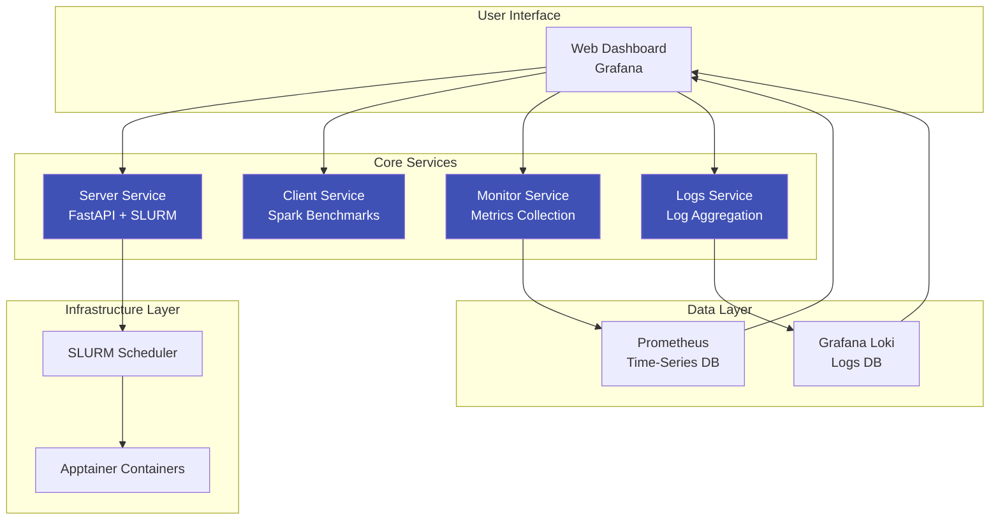
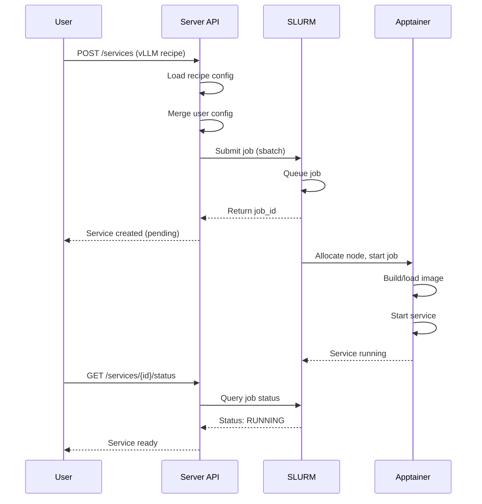
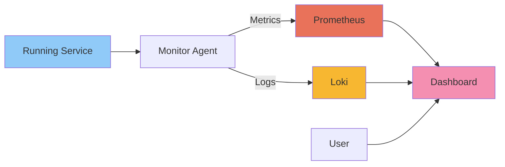

# System Architecture

## Overview

The AI Factory Benchmarking Framework uses a **microservices architecture** to provide flexible, scalable benchmarking of AI infrastructure components on HPC systems.

## High-Level Architecture



## Core Components

### 1. Server Service

**Purpose**: Central orchestration hub for service deployment and management.

**Key Features**:
- RESTful API for service lifecycle management
- SLURM job scheduling and monitoring
- Apptainer container orchestration
- Recipe-based service templates
- Dynamic resource allocation

**Technologies**:
- FastAPI (Python)
- SLURM REST API
- Apptainer/Singularity
- YAML-based recipes

[Learn more →](../services/server/overview.md)

### 2. Client Service

**Purpose**: Execute benchmark workloads against deployed services.

**Key Features**:
- Configurable workload generation
- Performance testing (throughput, latency)
- Load testing and stress testing
- Result aggregation

**Technologies**:
- Apache Spark
- Python

### 3. Monitoring Service

**Purpose**: Collect and export performance metrics.

**Metrics Collected**:
- System metrics (CPU, memory, GPU)
- Application metrics (requests/sec, latency)
- Resource utilization
- SLURM job statistics

**Technologies**:
- Python
- Prometheus exporters
- `/proc` filesystem monitoring

### 4. Logging Service

**Purpose**: Aggregate and forward logs for analysis.

**Log Sources**:
- SLURM job logs (`.out`, `.err` files)
- Application logs
- System logs
- Container logs

**Technologies**:
- Rust
- Grafana Loki API

### 5. Web Dashboard

**Purpose**: Visualization and control interface.

**Features**:
- Real-time metrics visualization
- Log exploration and search
- Service management UI
- Benchmark results analysis

**Technologies**:
- Grafana
- Prometheus datasource
- Loki datasource

## Data Flow

### Service Deployment Flow



### Monitoring Data Flow



## Deployment Model

### Container Orchestration

Services run in **Apptainer containers** for:

- **Reproducibility** - Consistent environment
- **Isolation** - Dependency management
- **Portability** - Same container on any node
- **Security** - User-space containerization (no root)

### SLURM Integration

```
┌─────────────────────────────────────┐
│         SLURM Cluster               │
├─────────────────────────────────────┤
│  Compute Nodes                      │
│  ┌──────────┐  ┌──────────┐        │
│  │  Job 1   │  │  Job 2   │        │
│  │ ┌──────┐ │  │ ┌──────┐ │        │
│  │ │ vLLM │ │  │ │Vector│ │        │
│  │ │Container│  │ │  DB  │ │       │
│  │ └──────┘ │  │ └──────┘ │        │
│  └──────────┘  └──────────┘        │
└─────────────────────────────────────┘
         ↑
         │ REST API
         │
┌────────┴──────────┐
│  Server Service   │
│   (Login Node)    │
└───────────────────┘
```

## Communication Patterns

### Inter-Service Communication

| Source | Target | Protocol | Purpose |
|--------|--------|----------|---------|
| UI | Server | HTTP/REST | Service management |
| UI | Grafana | HTTP | Visualization |
| Server | SLURM | REST API | Job control |
| Monitor | Prometheus | HTTP | Metrics push |
| Logs | Loki | HTTP | Log forwarding |
| Client | Service | HTTP | Benchmark requests |

### Network Architecture

```
Login Node (Server Service)
    ↓ SLURM REST API
Compute Nodes (Services in Containers)
    ↓ Metrics/Logs
Data Layer (Prometheus, Loki)
    ↓ Query API
Web Dashboard (Grafana)
```

## Scalability

### Horizontal Scaling

- Multiple service instances via SLURM
- Independent compute node allocation
- Load distribution across nodes

### Vertical Scaling

- Configurable CPU/GPU/Memory per service
- Dynamic resource requests
- Per-recipe resource templates

## Fault Tolerance

### Service Level

- SLURM job retry policies
- Container health checks
- Automatic restart on failure

### Data Level

- Persistent storage for logs
- Metrics retention policies
- State recovery mechanisms

## Security

### Access Control

- SLURM user authentication
- Project-based resource allocation
- Network isolation per job

### Container Security

- User-space containers (no privilege escalation)
- Read-only container images
- Minimal attack surface

## Performance Considerations

### Optimization Strategies

1. **Container Caching** - Pre-built images for fast startup
2. **Resource Pinning** - CPU/GPU affinity for performance
3. **Batch Job Optimization** - Efficient SLURM queue management
4. **Network Optimization** - Node-local communication when possible

### Monitoring Overhead

- Lightweight monitoring agents
- Sampling-based metrics collection
- Configurable collection intervals

## Future Enhancements

- **Auto-scaling** - Dynamic resource adjustment
- **Multi-cluster** - Support for multiple SLURM clusters
- **Advanced Scheduling** - ML-based resource prediction
- **Federation** - Cross-site benchmarking

---

Next: [Microservices Details](microservices.md) | [Container Orchestration](container-orchestration.md)
