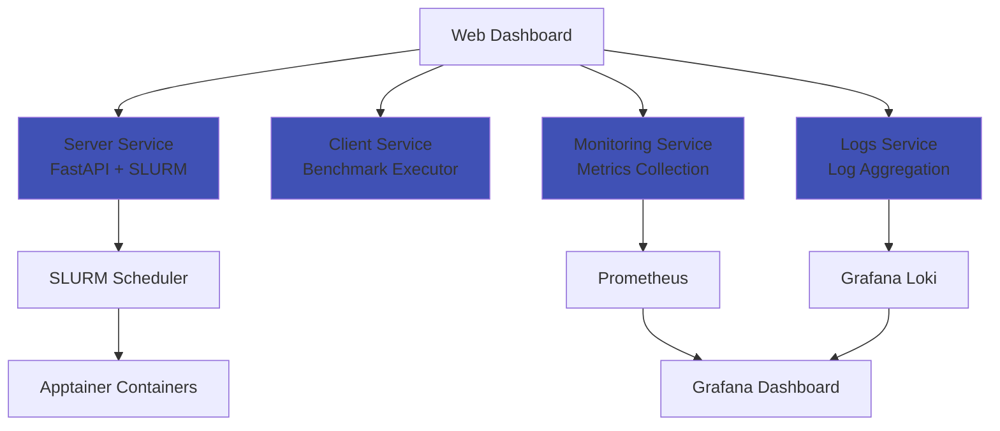

# AI Factory Benchmarking Framework

Welcome to the **AI Factory Benchmarking Framework** documentation.

## Project Overview

This framework enables benchmarking of AI Factory components in HPC environments, providing:

- **Automated Service Deployment** - Deploy AI services (LLMs, databases, vector stores) via SLURM + Apptainer
- **Performance Testing** - Client testing with configurable workloads
- **Real-time Monitoring** - Metrics collection and visualization with Prometheus + Grafana
- **Log Aggregation** - Centralized logging with Grafana Loki
- **Interactive Dashboard** - Web-based UI for benchmarking control and visualization

## Architecture

The system follows a microservices architecture with the following core components:

## Quick Start

TODO: Short quick start guide.

See the [Getting Started Guide](getting-started/overview.md) for detailed instructions.

## Services

[Learn more →](services/server/overview.md)

### Supported Server Services
- **vLLM** - High-performance LLM inference
- **Chroma** - Vector database

[View all available recipes →](services/server/recipes.md)

## Documentation Sections

- **[Getting Started](getting-started/overview.md)** - Installation, setup, and quick start guide
- **[Architecture](architecture/overview.md)** - System design, components, and data flow
- **[Services](services/server/overview.md)** - Detailed documentation for each microservice
- **[Development](development/guidelines.md)** - Development guidelines, testing, and contribution guide
- **[Deployment](deployment/meluxina.md)** - Deployment on MeluXina and other HPC systems

## Contributing

Please see our [Contributing Guide](development/contributing.md) for details on:

- Code style and standards
- Testing requirements
- Pull request process
- Development workflow

## EUMaster4HPC Challenge

This project is developed as part of the **EUMaster4HPC Challenge** (2025-2026), focusing on benchmarking AI infrastructure components in the MeluXina HPC.

---

**Status**: Active Development | **Version**: 0.1.0 | **Last Updated**: October 2025
