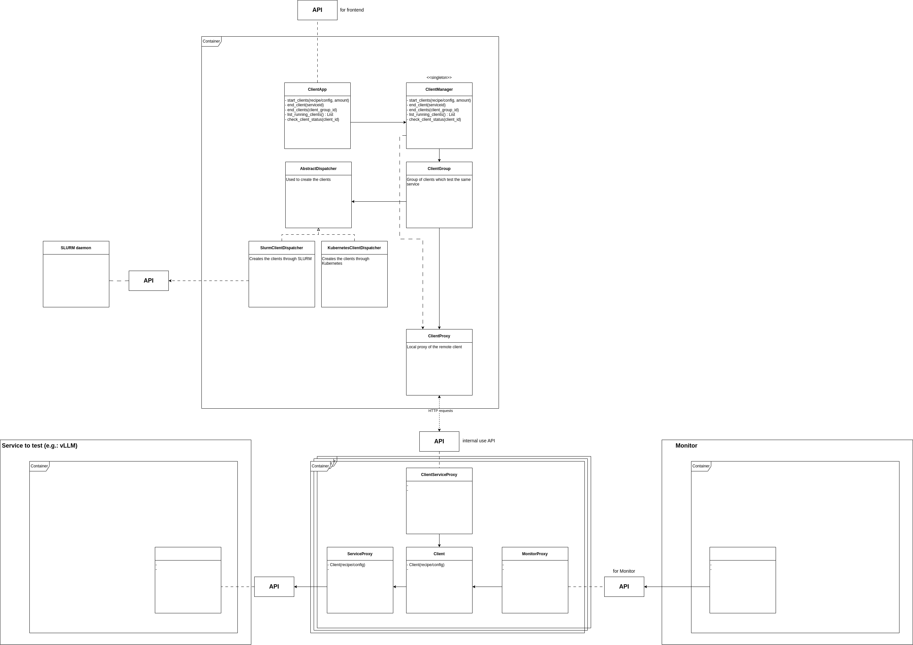

# Client Microservice Documentation

## Documentation overview
1. [Future developments](#1-future-developments-aka-todo)
2. [Introduction](#2-introduction---what-is-the-client-microservice)
    - [Flexibility for future expansions](#flexibility-for-future-expansions)
3. [Spawning clients](#3-spawning-clients)
4. [Interaction with the services provided by Server Microservice](#4-interaction-with-the-services-provided-by-server-microservice)
    - [Pre-built interaction](#1-pre-built-interaction)
    - [User-customized interaction](#2-user-customized-interaction)
    - [Configuration file](#configuration-file)
5. [API documentation](#5-api-documentation)
    - [API for Frontend](#api-for-frontend)
    - [API for Monitor Microservice](#api-for-monitor-microservice)
    - [API for internal use](#api-for-internal-use)
6. [Architecture overview](#6-architecture-overview)

## 1. Future developments (aka TODO)
- Call Hello World of Server Microservice
- Interact with vLLM service in the most simple way (i.e. send prompt)
    1. Then do it with multiple clients at the same time
    2. Then add latency tracking
    3. Then add latency report to the monitor
- Create the APIs
- Develop the configuration file for client behaviour (until now even the pre-built interaction are very "fixed")
- Make clients of the same ClientCluster able to do different things (trivially: sending different prompts to vLLM, in practice: having different config)
- Update the documentation with these new changes
- Move class diagram from drawio to mermaid
    - Break it into multiple pieces for readability
    - Explain them

## 2. Introduction - What is the Client Microservice?
This service provides to the user the ability to spawn multiple clients to test some services 
provided by the Server Microservice.

It works both with a Kubernetes-based or a Slurm-based environment.

Specifically, this microservice has 2 purposes:
1. Interact with a service provided by the Server Microservice in a **flexible** and 
   **user-controlled** way.
    - Example: interact with the vLLM engine by sending prompts or doing more advanced 
      interaction developed by the user
2. Provide **statistics** about the interaction with the service, used by Monitor 
   Microservice to collect them. 
    - Example: after the answer of vLLM engine on a input prompt, measure the latency and 
      give it back

### Flexibility for future expansions
This microservice has been built with a flexible architecture such that expanding the code is 
easier and little modification of the already written code is needed.

## 3. Spawning clients
This Microservice makes available spawning multiple clients, both via Slurm or Kubernetes.
They will interact with a service provided by the Server Microservice.

Spawning clients requires handing over through the API (see [API for frontend](#api-for-frontend))
the configuration file.

## 4. Interaction with the services provided by Server Microservice
The interaction with the services provided by Server Microservice can happen in 2 ways:
1. Pre-built interaction
2. User-customized interaction

### 1. Pre-built interaction. 
Some default interactions are already written in the code, user does not need to implement 
any of these.
- This provides the user with the capability of running benchmarks without having to 
  writing them.
- Example: the default interaction with the vLLM engine is a single prompt sent by each 
  client

(Cooming soon) Even though the interaction is pre-built, there is a little of flexibility
how the client behaves. This is done through the configuration file. Read 
[Configuration file](#configuration-file) for more info.

### 2. User-customized interaction
If the default interactions are not enough, this Microservice makes easily available to the 
user to create new tests.

## Configuration file

## 5. API documentation
### API for Frontend
Here is described the REST API which the Client Service exposes for the frontend.

### API for Monitor Microservice
Here is described the REST API which the Client Service exposes for the monitor.

### API for internal use
Here is described the REST API which the Client Service uses internally.

## 6. Architecture overview
