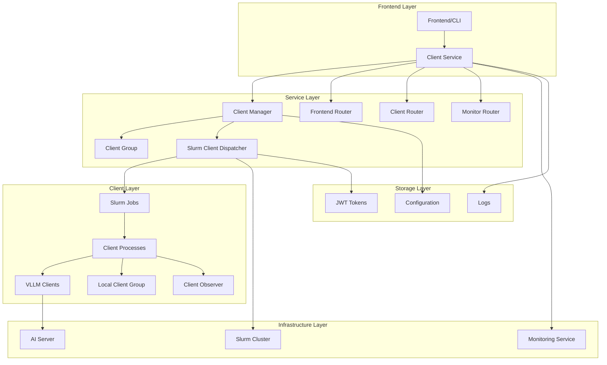
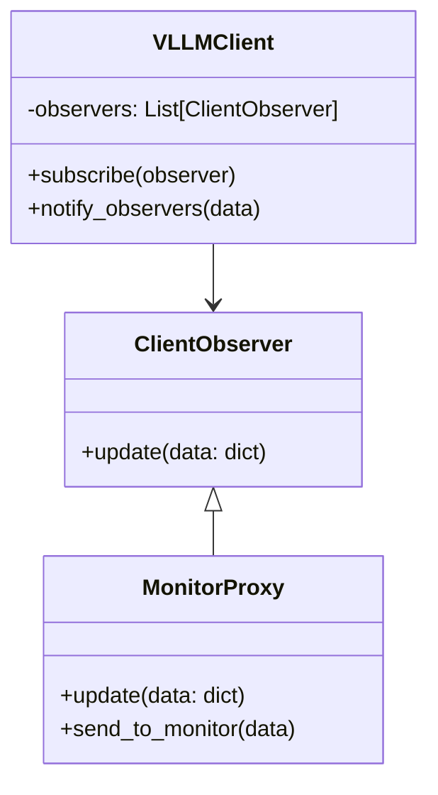
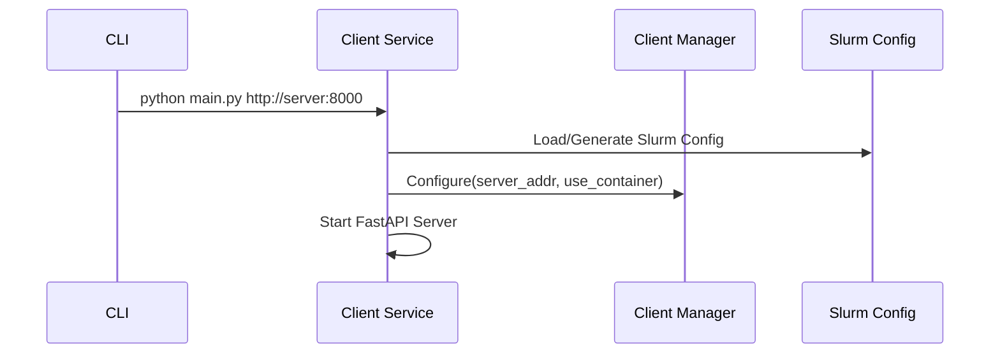
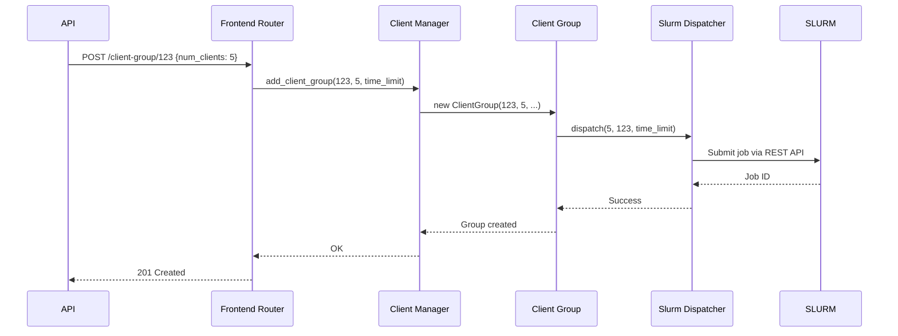
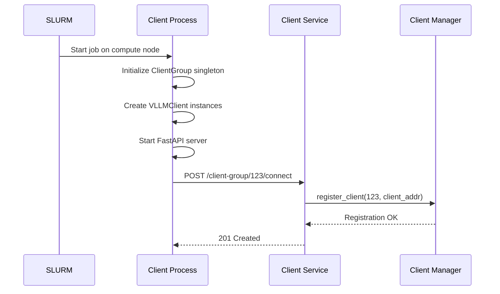
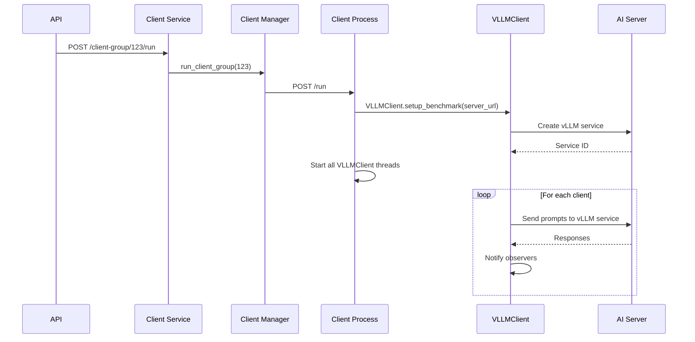
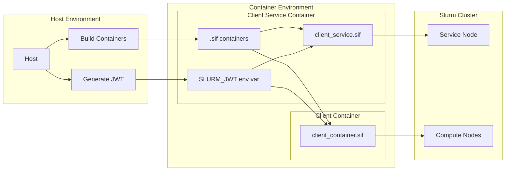
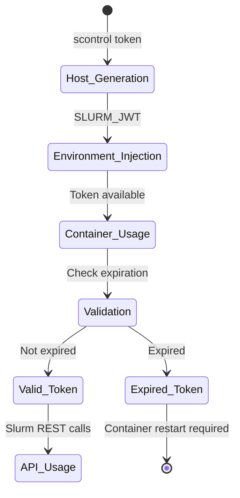

````markdown
# AI Factory Client Services - Architecture Guide

## 🏗️ Architectural Overview

The AI Factory Client Services system implements a distributed microservices architecture designed for scalable management of AI benchmarks on HPC infrastructures. The architecture is organized into three main layers that ensure separation of responsibilities and horizontal scalability.

## 📊 Architectural Diagram



## 🎯 Main Components

### 1. Service Layer (Client Service)

The service layer is the central orchestration point of the system.

#### ClientManager (Singleton)
```python
class ClientManager:
    """Manages client groups and coordinates Slurm deployment"""
    
    # Responsibilities:
    # - Client group lifecycle management
    # - Coordination with Slurm scheduler
    # - Proxy requests to client processes
    # - Configuration management
```

**Key Features:**
- **Singleton Pattern**: Single instance per service
- **Thread Safety**: Safe handling of concurrent requests  
- **State Management**: benchmark_id → Client Group mapping
- **Slurm Integration**: Automatic job dispatch

#### Frontend Router
Exposes REST APIs for system management:

```yaml
Endpoints:
  POST /api/v1/client-group/{id}:
    description: Create new client group
    payload: {num_clients: int, time_limit: int}
    
  GET /api/v1/client-group/{id}:
    description: Get client group info
    
  DELETE /api/v1/client-group/{id}:
    description: Remove client group
    
  POST /api/v1/client-group/{id}/run:
    description: Start benchmark execution
```

#### Client Router
Manages client process registration:

```yaml
Endpoints:
  POST /api/v1/client-group/{id}/connect:
    description: Register client process
    payload: {client_address: string}
```

### 2. Client Layer (Client Processes)

The client layer executes actual benchmarks on compute nodes.

#### VLLMClient
```python
class VLLMClient:
    """Specialized client for vLLM services"""
    
    # Shared static variables:
    _service_id: str = None      # vLLM service ID
    _server_base_url: str = None # AI server URL
    
    @staticmethod
    def setup_benchmark(server_url: str) -> str:
        """Setup shared vLLM service"""
        # Create vLLM service on server
        # Set static variables for all clients
```

**Configuration Pattern:**
1. **Setup Benchmark**: Called once per group
2. **Shared State**: All instances use same service_id
3. **Dynamic Server**: Runtime configurable server URL

#### ClientGroup (Local Singleton)
```python
class ClientGroup:
    """Manages client group on single process"""
    
    # Responsibilities:
    # - Local client coordination
    # - Observer registration
    # - Parallel thread execution
    # - Status reporting
```

#### Observer Pattern


### 3. Deployment Layer

Manages deployment and configuration on HPC infrastructure.

#### Slurm Client Dispatcher
```python
class SlurmClientDispatcher:
    """Dispatch Slurm jobs for client processes"""
    
    def dispatch(self, num_clients: int, benchmark_id: int, time: int):
        # Build Slurm script
        # Submit job via REST API
        # Configure environment variables
        # Handle container mode
```

**Container Support:**
```bash
# Native execution
./start_client.sh 3 http://server:8000 http://service:8001 123

# Container execution  
./start_client.sh 3 http://server:8000 http://service:8001 123 --container
```

#### Slurm Configuration Management
```python
class SlurmConfig:
    """Automatic Slurm configuration management"""
    
    # Auto-detection:
    # - Username from environment
    # - JWT token from SLURM_JWT env var
    # - Cluster configuration from defaults
    
    # Container mode:
    # - Pre-generated token on host
    # - Refresh disabled
    # - Environment variables injection
```

#### JWT Token Management
```python
class SlurmToken:
    """Advanced Slurm JWT token management"""
    
    # Capabilities:
    # - Automatic JWT parsing
    # - Expiration validation
    # - Claims extraction
    # - Remaining lifetime calculation
```

## 🔄 Execution Workflow

### 1. System Initialization



### 2. Client Group Creation



### 3. Client Process Startup



### 4. Benchmark Execution



## 🔧 Configuration and Deployment

### Container Architecture



### Configuration Hierarchy

```yaml
Configuration Sources (precedence order):
  1. Command line arguments:
     - server_addr (required)
     - --container flag
     - slurm_config_file (optional)
  
  2. Environment variables:
     - SLURM_JWT (token)
     - USER/USERNAME (username)
  
  3. Configuration file:
     - url, user_name, api_ver, account, jwt
  
  4. Auto-detection defaults:
     - Slurm cluster URL
     - Current user
     - Latest API version
```

## 🎛️ Monitoring and Observability

### Observer Pattern Implementation

```python
# Client-side monitoring
client = VLLMClient()
monitor_observer = MonitorProxy("monitor.host", "8080", preferences)
client.subscribe(monitor_observer)

# Automatic notifications
client.run()  # Triggers observer.update() on completion
```

### Logging Architecture

```yaml
Logging Levels:
  - DEBUG: Detailed execution flow
  - INFO: Major operations and status
  - WARNING: Recoverable issues
  - ERROR: Failures requiring attention

Log Destinations:
  - Console: Real-time feedback
  - Files: Persistent debugging
  - Slurm: Standard out/err capture
```

## 🔐 Security and Authentication

### JWT Token Lifecycle



### Security Features

- **No Token Refresh in Containers**: Prevents privilege escalation
- **Environment Isolation**: Safe token injection via env vars
- **Automatic Expiration Checking**: Continuous token validation
- **Least Privilege**: Client processes with minimal permissions

## 📈 Scalability and Performance

### Horizontal Scaling

```yaml
Scaling Patterns:
  Service Layer:
    - Multiple client service instances
    - Load balancer distribution
    - Shared state via external storage
  
  Client Layer:
    - Automatic Slurm node allocation
    - Dynamic client process spawning
    - Independent process execution
  
  Infrastructure:
    - Multi-node Slurm clusters
    - Container registry distribution
    - Network optimization
```

### Performance Considerations

- **Async Operations**: FastAPI async handlers
- **Thread Parallelism**: Multiple client threads per process
- **Container Caching**: Apptainer image reuse
- **Network Optimization**: Keep-alive connections
- **Resource Management**: Slurm allocation limits

## 🔧 Extensibility

### Plugin Architecture

```python
# Nuovo tipo di client
class CustomAIClient(VLLMClient):
    def run(self):
        # Custom implementation
        pass

# Nuovo dispatcher
class KubernetesDispatcher(AbstractClientDispatcher):
    def dispatch(self, num_clients, benchmark_id, time):
        # Kubernetes deployment logic
        pass
```

### Configuration Extension

```python
# Custom configuration providers
class DatabaseConfig(SlurmConfig):
    def load_from_database(self, connection_string):
        # Load from external database
        pass
```

This architecture provides a solid foundation for system evolution while maintaining flexibility and ease of maintenance.