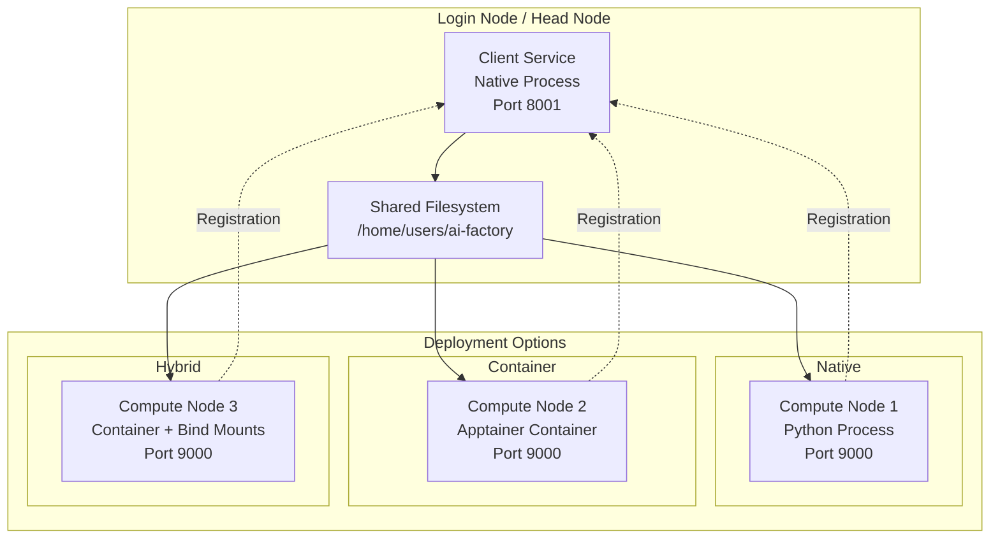

# AI Factory Client Services - Deployment Guide

## 🚀 Deployment Overview

The AI Factory Client Services system supports various deployment modes to adapt to different HPC and containerized environments:

- **Native Deployment** - Direct execution on filesystem
- **Container Deployment** - Using Apptainer/Singularity
- **Hybrid Deployment** - Native Client Service + Containerized Client Processes
- **Development Deployment** - Local setup for testing

## 🏗️ Architettura Deployment



## 📋 Prerequisites

### System Requirements

**Login/Head Node:**
- Python 3.8+
- 4+ GB available RAM
- Slurm access (sbatch, squeue, scontrol)
- Network connectivity to compute nodes

**Compute Nodes:**
- Python 3.8+ (native deployment)
- Apptainer/Singularity (container deployment)
- 2+ GB RAM per client process
- HTTP connectivity to Login Node

### Software Dependencies

```bash
# Required Python packages
pip install fastapi uvicorn httpx aiofiles

# System packages (Ubuntu/Debian)
sudo apt-get update
sudo apt-get install python3-dev python3-pip curl wget

# System packages (CentOS/RHEL)
sudo yum install python3-devel python3-pip curl wget
```

## 🛠️ Native Deployment

### 1. Environment Preparation

```bash
# Repository clone
cd /home/users/ai-factory
git clone <repository-url> Benchmarking-AI-Factories
cd Benchmarking-AI-Factories/services/client

# Virtual environment setup
python3 -m venv venv
source venv/bin/activate
pip install --upgrade pip

# Install dependencies
pip install -r requirements.txt
```

### 2. Configuration

```bash
# File: config/production.env
export CLIENT_SERVICE_HOST="login-node-01.hpc.local"
export CLIENT_SERVICE_PORT="8001"
export AI_SERVER_HOST="ai-server.hpc.local"
export AI_SERVER_PORT="8000"
export SLURM_PARTITION="gpu"
export SLURM_ACCOUNT="ai-factory"
export LOG_LEVEL="INFO"
export PYTHONPATH="/home/users/ai-factory/Benchmarking-AI-Factories/services/client/src"

# Load configuration
source config/production.env
```

### 3. Client Service Startup

```bash
# Manual startup for testing
python src/main.py --host 0.0.0.0 --port 8001

# Startup with systemd (production)
sudo cp scripts/client-service.service /etc/systemd/system/
sudo systemctl enable client-service
sudo systemctl start client-service
```

### 4. Deployment Verification

```bash
# Test endpoint
curl -f http://localhost:8001/docs

# Test basic functionality
curl -X POST http://localhost:8001/api/v1/client-group/999 \
    -H "Content-Type: application/json" \
    -d '{"num_clients": 1, "time_limit": 5}'

# Verify Slurm registration
squeue -u $USER | grep benchmark-client
```

## 🐳 Container Deployment

### 1. Build Apptainer Container

```bash
# Prepare Dockerfile
cat > Dockerfile <<EOF
FROM python:3.9-slim

# System dependencies
RUN apt-get update && apt-get install -y \
    curl \
    && rm -rf /var/lib/apt/lists/*

# App directory
WORKDIR /app

# Python dependencies
COPY requirements.txt .
RUN pip install --no-cache-dir -r requirements.txt

# Application code
COPY src/ src/
COPY config/ config/

# Default port
EXPOSE 9000

# Health check
HEALTHCHECK --interval=30s --timeout=10s --start-period=5s --retries=3 \
    CMD curl -f http://localhost:9000/status || exit 1

# Default command
CMD ["python", "src/main.py", "--host", "0.0.0.0", "--port", "9000"]
EOF

# Build container
apptainer build client-service.sif Dockerfile
```

### 2. Local Container Test

```bash
# Test basic run
apptainer run client-service.sif

# Test with port mapping
apptainer run --net --network-args="portmap=9000:9000/tcp" \
    client-service.sif python src/main.py --port 9000

# Test with environment
apptainer run --env CLIENT_SERVICE_HOST=localhost \
    client-service.sif python src/main.py
```

### 3. Deploy on Slurm

```bash
# File: slurm_container_template.sh
cat > container_job_template.sh <<'EOF'
#!/bin/bash
#SBATCH --job-name=benchmark-client-{benchmark_id}
#SBATCH --output=logs/client_dispatcher_{benchmark_id}.out
#SBATCH --error=logs/client_dispatcher_{benchmark_id}.err
#SBATCH --nodes={num_clients}
#SBATCH --ntasks-per-node=1
#SBATCH --cpus-per-task=4
#SBATCH --mem=8G
#SBATCH --time={time_limit}:00
#SBATCH --partition={partition}

# Environment setup
export CLIENT_SERVICE_ADDR="{client_service_addr}"
export AI_SERVER_ADDR="{ai_server_addr}"
export BENCHMARK_ID="{benchmark_id}"

# Container bind mounts
export APPTAINER_BIND="/home,/scratch,/tmp"

# Launch container
srun apptainer exec \
    --cleanenv \
    --env CLIENT_SERVICE_ADDR=$CLIENT_SERVICE_ADDR \
    --env AI_SERVER_ADDR=$AI_SERVER_ADDR \
    --env BENCHMARK_ID=$BENCHMARK_ID \
    /home/users/ai-factory/client-service.sif \
    python /app/src/main.py \
        --client-service-addr $CLIENT_SERVICE_ADDR \
        --ai-server-addr $AI_SERVER_ADDR \
        --benchmark-id $BENCHMARK_ID
EOF
```

## 🔧 Hybrid Deployment

### Native Client Service + Containerized Client Processes

This setup combines the best of both approaches:

```bash
# Login node: Native Client Service
cd /home/users/ai-factory/Benchmarking-AI-Factories/services/client
python src/main.py --host 0.0.0.0 --port 8001

# Compute nodes: Containerized client processes
# (managed automatically by ClientDispatcher)
```

### Hybrid Configuration

```python
# File: src/client_service/client_manager/hybrid_config.py

HYBRID_SLURM_TEMPLATE = '''#!/bin/bash
#SBATCH --job-name=benchmark-client-{benchmark_id}
#SBATCH --nodes={num_clients}
#SBATCH --ntasks-per-node=1

# Native system - Client Service
export CLIENT_SERVICE_ADDR="{client_service_addr}"
export AI_SERVER_ADDR="{ai_server_addr}"

# Container - Client Process
export APPTAINER_BIND="/home,/scratch"
export CONTAINER_PATH="/home/users/ai-factory/client-service.sif"

# Launch containerized client
srun apptainer exec $CONTAINER_PATH \
    python /app/src/main.py \
    --client-service-addr $CLIENT_SERVICE_ADDR \
    --ai-server-addr $AI_SERVER_ADDR \
    --benchmark-id {benchmark_id}
'''
```

## 💻 Development Deployment

### Local Multi-Process Setup

```bash
# Terminal 1: Simulate AI Server
python -m http.server 8000 --directory /tmp

# Terminal 2: Client Service
cd services/client
python src/main.py --host localhost --port 8001

# Terminal 3: Simulated Client Process
python src/client/main.py \
    --client-service-addr http://localhost:8001 \
    --ai-server-addr http://localhost:8000 \
    --benchmark-id 123 \
    --port 9000

# Terminal 4: Testing
curl -X POST http://localhost:8001/api/v1/client-group/123 \
    -H "Content-Type: application/json" \
    -d '{"num_clients": 1}'
```

### Docker Compose for Development

```yaml
# File: docker-compose.dev.yml
version: '3.8'

services:
  ai-server:
    image: nginx:alpine
    ports:
      - "8000:80"
    volumes:
      - ./dev-data:/usr/share/nginx/html
  
  client-service:
    build: .
    ports:
      - "8001:8001"
    environment:
      - CLIENT_SERVICE_HOST=localhost
      - AI_SERVER_HOST=ai-server
      - LOG_LEVEL=DEBUG
    command: python src/main.py --host 0.0.0.0 --port 8001
    
  client-process:
    build: .
    ports:
      - "9000:9000"
    environment:
      - CLIENT_SERVICE_ADDR=http://client-service:8001
      - AI_SERVER_ADDR=http://ai-server:80
      - BENCHMARK_ID=123
    command: python src/client/main.py --port 9000
    depends_on:
      - client-service
      - ai-server
```

```bash
# Start development environment
docker-compose -f docker-compose.dev.yml up -d

# Test setup
curl http://localhost:8001/docs
curl http://localhost:9000/status
```

## 🚀 Production Deployment

### High Availability Setup

```bash
# File: scripts/ha_deployment.sh

# 1. Deploy Client Service with load balancer
for node in login-01 login-02; do
    ssh $node "
        cd /home/ai-factory/client-service &&
        source venv/bin/activate &&
        nohup python src/main.py --port 800$((${node: -1} + 1)) > logs/service_$node.log 2>&1 &
    "
done

# 2. Configure HAProxy/Nginx load balancer
cat > /etc/haproxy/haproxy.cfg <<EOF
global
    daemon

defaults
    mode http
    timeout connect 5000ms
    timeout client 50000ms
    timeout server 50000ms

frontend client_service_frontend
    bind *:8001
    default_backend client_service_backend

backend client_service_backend
    balance roundrobin
    server login-01 login-01:8001 check
    server login-02 login-02:8002 check
EOF

systemctl restart haproxy
```

### Monitoring Setup

```bash
# File: scripts/monitoring_setup.sh

# 1. Prometheus endpoint
cat > /etc/prometheus/targets/client-service.yml <<EOF
- targets:
  - 'login-01:8001'
  - 'login-02:8002'
  labels:
    service: 'client-service'
    environment: 'production'
EOF

# 2. Health check script
cat > /usr/local/bin/client-service-health.sh <<'EOF'
#!/bin/bash
for host in login-01:8001 login-02:8002; do
    if curl -sf http://$host/docs >/dev/null; then
        echo "OK: $host"
    else
        echo "FAIL: $host" >&2
        # Alert logic here
    fi
done
EOF

chmod +x /usr/local/bin/client-service-health.sh

# 3. Cron job for health checks
echo "*/5 * * * * /usr/local/bin/client-service-health.sh" | crontab -
```

## 🔍 Deployment Troubleshooting

### Common Issues

#### Port Conflicts

```bash
# Check ports in use
netstat -tlnp | grep :8001
ss -tlnp | grep :8001

# Find processes on port
lsof -i :8001

# Kill process on port
kill $(lsof -t -i:8001)
```

#### Permission Issues

```bash
# Check directory permissions
ls -la /home/users/ai-factory/
find . -name "*.py" ! -executable -exec chmod +x {} \;

# Check ownership
chown -R ai-factory:ai-factory /home/users/ai-factory/

# Slurm permissions
groups ai-factory
sacctmgr show user ai-factory
```

#### Network Connectivity

```bash
# Test basic connectivity
ping login-node-01
telnet login-node-01 8001

# Test from compute nodes
srun --nodes=1 --pty bash
curl -v http://login-node-01:8001/docs

# Check firewall
sudo iptables -L | grep 8001
sudo firewall-cmd --list-ports
```

#### Container Issues

```bash
# Debug container run
apptainer exec --debug client-service.sif /bin/bash

# Check bind mounts
apptainer exec client-service.sif ls -la /home

# Container logs
apptainer run client-service.sif 2>&1 | tee container.log
```

### Performance Tuning

```bash
# File: config/performance.conf

# Uvicorn workers
export UVICORN_WORKERS=4
export UVICORN_WORKER_CLASS="uvicorn.workers.UvicornWorker"

# HTTP timeouts
export HTTP_TIMEOUT=30
export HTTP_MAX_RETRIES=3

# Slurm polling
export SLURM_POLL_INTERVAL=5
export SLURM_MAX_JOBS=100

# Resource limits
ulimit -n 65536  # File descriptors
ulimit -u 32768  # Max processes
```

## 📊 Deployment Validation

### Complete Test Suite

```bash
# File: scripts/deployment_test.sh
#!/bin/bash

echo "=== AI Factory Deployment Test ==="

# 1. Service health
echo "Testing service health..."
curl -f http://localhost:8001/docs || exit 1

# 2. API functionality
echo "Testing API functionality..."
benchmark_id=$RANDOM
curl -X POST http://localhost:8001/api/v1/client-group/$benchmark_id \
    -H "Content-Type: application/json" \
    -d '{"num_clients": 1, "time_limit": 2}' || exit 1

# 3. Slurm integration
echo "Testing Slurm integration..."
sleep 30
if ! squeue -u $USER | grep -q "benchmark-client-$benchmark_id"; then
    echo "ERROR: Slurm job not found"
    exit 1
fi

# 4. Client registration (wait for job to start)
echo "Waiting for client registration..."
sleep 60
if curl -f http://localhost:8001/api/v1/client-group/$benchmark_id | grep -q client_address; then
    echo "SUCCESS: Client registered"
else
    echo "WARNING: Client not registered yet"
fi

# 5. Cleanup
echo "Cleaning up..."
curl -X DELETE http://localhost:8001/api/v1/client-group/$benchmark_id

echo "=== Deployment test completed ==="
```

### Smoke Tests

```bash
# Quick smoke test
scripts/run_tests.sh --module test_deployment --verbose

# Performance baseline
scripts/benchmark_deployment.sh --clients 10 --duration 5

# Load testing
scripts/load_test.sh --concurrent 5 --requests 100
```

This guide provides all the tools and procedures necessary for a robust and scalable deployment of the AI Factory Client Services system in production HPC environments.