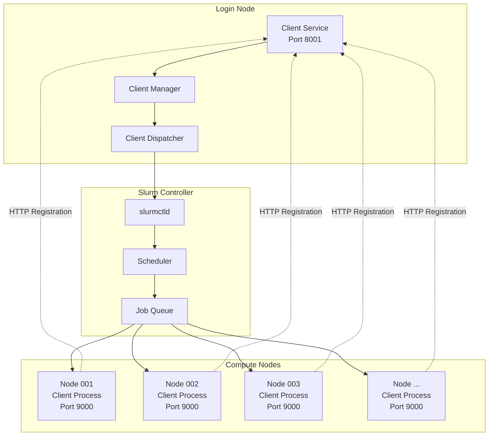

# AI Factory Client Services - Slurm HPC Integration

## 🚀 Integration Overview

The AI Factory Client Services system is designed to operate on HPC clusters managed by Slurm. The integration enables:

- **Automatic deployment** of client processes on compute nodes
- **Resource management** through Slurm jobs with resource allocation
- **Horizontal scalability** across hundreds of compute nodes
- **Process isolation** with Apptainer containers

## 🏗️ Slurm Architecture



## ⚙️ Slurm Configuration

### Environment Setup

The system requires the following environment variables:

```bash
# File: ~/.bashrc or /etc/environment
export SLURM_PARTITION="gpu"           # Default partition
export SLURM_QOS="normal"              # Quality of Service
export SLURM_ACCOUNT="ai-factory"      # Slurm account
export CLIENT_SERVICE_HOST="login-node-01"  # Client Service host
export CLIENT_SERVICE_PORT="8001"      # Client Service port
export AI_SERVER_HOST="ai-server"      # AI server host
export AI_SERVER_PORT="8000"           # AI server port
```

### Slurm Configuration Files

#### Basic Job Template

The `slurm_config.py` file contains the template for Slurm jobs:

```python
# File: src/client_service/client_manager/slurm_config.py

SLURM_JOB_TEMPLATE = '''#!/bin/bash
#SBATCH --job-name=benchmark-client-{benchmark_id}
#SBATCH --output={log_dir}/client_dispatcher_{benchmark_id}.out
#SBATCH --error={log_dir}/client_dispatcher_{benchmark_id}.err
#SBATCH --nodes={num_clients}
#SBATCH --ntasks-per-node=1
#SBATCH --cpus-per-task=4
#SBATCH --mem=8G
#SBATCH --time={time_limit}:00
#SBATCH --partition={partition}
{qos_line}
{account_line}

# Environment setup
export CLIENT_SERVICE_ADDR="{client_service_addr}"
export AI_SERVER_ADDR="{ai_server_addr}"
export BENCHMARK_ID="{benchmark_id}"

# Launch client process
{launch_command}
'''
```

#### Advanced Configuration

For specific clusters, customize parameters:

```python
# Configuration for NVIDIA DGX cluster
DGX_CONFIG = {
    "partition": "dgx",
    "qos": "gpu",
    "gres": "gpu:1",
    "constraint": "dgx_a100",
    "cpus_per_task": 8,
    "mem": "32G"
}

# Configuration for CPU-only cluster
CPU_CONFIG = {
    "partition": "cpu",
    "qos": "normal", 
    "cpus_per_task": 16,
    "mem": "64G",
    "constraint": "skylake"
}
```

## 🐳 Container Integration

### Apptainer Setup

The system supports deployment via Apptainer containers:

```bash
# Build container (once)
apptainer build client-service.sif Dockerfile

# Test container locally
apptainer run client-service.sif python src/main.py --port 9000

# Deploy via Slurm
sbatch --wrap="apptainer run client-service.sif python src/main.py"
```

### Container-Enabled Job Template

```bash
#!/bin/bash
#SBATCH --job-name=benchmark-client-{benchmark_id}
#SBATCH --nodes={num_clients}
#SBATCH --ntasks-per-node=1

# Container deployment
export APPTAINER_BIND="/scratch,/tmp"
export BENCHMARK_ID="{benchmark_id}"

srun apptainer exec client-service.sif \
    python /app/src/main.py \
    --client-service-addr {client_service_addr} \
    --ai-server-addr {ai_server_addr} \
    --benchmark-id {benchmark_id}
```

## 📝 Slurm Job Lifecycle

### 1. Job Submission

```python
# The ClientDispatcher creates and submits the job
dispatcher = ClientDispatcher()
job_id = dispatcher.dispatch_clients(
    benchmark_id=123,
    num_clients=5,
    time_limit=10
)
print(f"Job submitted: {job_id}")
```

### 2. Job Monitoring

```python
# Job status monitoring
import subprocess

def check_job_status(job_id):
    result = subprocess.run(
        ["squeue", "-j", str(job_id), "--format=%T"],
        capture_output=True, text=True
    )
    return result.stdout.strip()

status = check_job_status(job_id)
print(f"Job status: {status}")  # PENDING, RUNNING, COMPLETED
```

### 3. Client Registration

Client processes register automatically:

```python
# Executed on each compute node
async def register_with_client_service():
    local_ip = get_local_ip()
    registration_data = {
        "client_address": f"http://{local_ip}:9000"
    }
    
    async with httpx.AsyncClient() as client:
        response = await client.post(
            f"{CLIENT_SERVICE_ADDR}/api/v1/client-group/{BENCHMARK_ID}/connect",
            json=registration_data
        )
    
    if response.status_code == 201:
        logger.info("Successfully registered with client service")
    else:
        logger.error(f"Registration failed: {response.status_code}")
```

## 🔧 Slurm Commands and Tools

### Basic Commands

```bash
# Submit job
sbatch job_script.sh

# List active jobs
squeue -u $USER

# Specific job details
scontrol show job <job_id>

# Cancel job
scancel <job_id>

# View job output in real-time
tail -f slurm-<job_id>.out
```

### Utility Scripts

#### monitor_jobs.sh
```bash
#!/bin/bash
# Monitor AI Factory jobs

USER=${1:-$USER}

echo "=== AI Factory Jobs Status ==="
squeue -u $USER --format="%.10i %.15j %.8T %.10M %.6D %R" \
    | grep "benchmark-client"

echo -e "\n=== Recent Job History ==="
sacct -u $USER --starttime=today --format="JobID,JobName,State,ExitCode,Start,End" \
    | grep "benchmark-client"
```

#### cleanup_jobs.sh
```bash
#!/bin/bash
# Cleanup terminated AI Factory jobs

echo "Cancelling all benchmark-client jobs..."
scancel -u $USER --name="benchmark-client"

echo "Cleaning up log files older than 7 days..."
find /home/$USER/logs -name "client_dispatcher_*.out" -mtime +7 -delete
find /home/$USER/logs -name "client_dispatcher_*.err" -mtime +7 -delete
```

## 🚀 Deployment Patterns

### Pattern 1: Single Benchmark

```bash
# Setup for a single benchmark
export BENCHMARK_ID=123
export NUM_CLIENTS=5

# Create group
curl -X POST http://client-service:8001/api/v1/client-group/$BENCHMARK_ID \
    -H "Content-Type: application/json" \
    -d "{\"num_clients\": $NUM_CLIENTS, \"time_limit\": 10}"

# Wait for registration (automatic)
sleep 60

# Start benchmark
curl -X POST http://client-service:8001/api/v1/client-group/$BENCHMARK_ID/run
```

### Pattern 2: Benchmark Batch

```bash
#!/bin/bash
# Execute batch of benchmarks with different parameters

BENCHMARK_CONFIGS=(
    "101:3:5"    # benchmark_id:num_clients:time_limit
    "102:5:10"
    "103:10:15"
    "104:20:30"
)

for config in "${BENCHMARK_CONFIGS[@]}"; do
    IFS=':' read -r benchmark_id num_clients time_limit <<< "$config"
    
    echo "Starting benchmark $benchmark_id with $num_clients clients..."
    
    # Create group
    curl -X POST http://client-service:8001/api/v1/client-group/$benchmark_id \
        -H "Content-Type: application/json" \
        -d "{\"num_clients\": $num_clients, \"time_limit\": $time_limit}"
    
    # Wait for stabilization
    sleep 30
done

# Wait for complete registration
sleep 120

# Start all benchmarks
for config in "${BENCHMARK_CONFIGS[@]}"; do
    IFS=':' read -r benchmark_id _ _ <<< "$config"
    
    echo "Running benchmark $benchmark_id..."
    curl -X POST http://client-service:8001/api/v1/client-group/$benchmark_id/run
    
    # Delay between benchmarks
    sleep 10
done
```

### Pattern 3: Dynamic Scaling

```bash
#!/bin/bash
# Scaling test with gradual increment

MAX_CLIENTS=100
STEP=10
TIME_LIMIT=20

for ((clients=STEP; clients<=MAX_CLIENTS; clients+=STEP)); do
    benchmark_id=$((1000 + clients))
    
    echo "Testing with $clients clients (benchmark $benchmark_id)..."
    
    # Create group
    curl -X POST http://client-service:8001/api/v1/client-group/$benchmark_id \
        -H "Content-Type: application/json" \
        -d "{\"num_clients\": $clients, \"time_limit\": $TIME_LIMIT}"
    
    # Wait and test
    sleep 90
    curl -X POST http://client-service:8001/api/v1/client-group/$benchmark_id/run
    
    # Wait for completion before next test
    sleep 300
    
    # Cleanup
    curl -X DELETE http://client-service:8001/api/v1/client-group/$benchmark_id
    sleep 30
done
```

## 📊 Resource Management

### CPU/Memory Planning

```bash
# Resource calculation for benchmark
NUM_CLIENTS=50
CPU_PER_CLIENT=4
MEM_PER_CLIENT=8  # GB

TOTAL_CPU=$((NUM_CLIENTS * CPU_PER_CLIENT))
TOTAL_MEM=$((NUM_CLIENTS * MEM_PER_CLIENT))

echo "Resource requirements:"
echo "- Nodes: $NUM_CLIENTS"
echo "- Total CPUs: $TOTAL_CPU"
echo "- Total Memory: ${TOTAL_MEM}GB"

# Check availability
sinfo --format="%.15P %.5a %.10l %.10s %.4r %.8T %.6D %.20N"
```

### GPU Resource Allocation

```python
# Configuration for GPU workloads
GPU_SLURM_CONFIG = '''#!/bin/bash
#SBATCH --job-name=benchmark-gpu-{benchmark_id}
#SBATCH --nodes={num_clients}
#SBATCH --ntasks-per-node=1
#SBATCH --gres=gpu:1
#SBATCH --cpus-per-task=8
#SBATCH --mem=32G
#SBATCH --partition=gpu
#SBATCH --time={time_limit}:00

# GPU environment
export CUDA_VISIBLE_DEVICES=0
export GPU_MEMORY_FRACTION=0.8

# Launch client with GPU support
srun apptainer exec --nv client-service.sif \
    python /app/src/main.py \
    --gpu-enabled \
    --benchmark-id {benchmark_id}
'''
```

## 🔍 Slurm Troubleshooting

### Common Issues

#### Job in PENDING

```bash
# Diagnose why job doesn't start
squeue -j <job_id> --start

# Check resource limits
scontrol show job <job_id>

# Check available partitions
sinfo --format="%.15P %.5a %.10l %.10s %.4r %.8T"
```

#### Clients Don't Register

```bash
# Check connectivity from compute nodes
srun --nodes=1 --pty bash
ping client-service-host
curl -f http://client-service-host:8001/docs

# Check job logs
cat slurm-<job_id>.out
cat slurm-<job_id>.err
```

#### Performance Issues

```bash
# Real-time resource monitoring
sstat -j <job_id> --format="JobID,MaxRSS,MaxVMSize,AvePages"

# Check load on nodes
srun --nodes=all uptime
srun --nodes=all free -h
```

### Log Analysis

```bash
# Aggregate logs from all clients
for job_id in $(squeue -u $USER -h -o "%i" | grep -v "CLUSTER"); do
    echo "=== Job $job_id ==="
    cat slurm-${job_id}.out 2>/dev/null | tail -10
    echo ""
done

# Search for common errors
grep -r "ConnectionError\|TimeoutError\|500 Internal Server Error" \
    /home/$USER/logs/ | tail -20
```

## 🎯 Best Practices

### Resource Efficiency

1. **Right-sizing**: Don't over-allocate CPU/memory
2. **Batching**: Group small jobs when possible
3. **Time limits**: Set realistic but not excessive limits
4. **Cleanup**: Cancel jobs no longer needed

### Fault Tolerance

1. **Health checks**: Implement client health checks
2. **Retry logic**: Handle temporary network failures
3. **Graceful shutdown**: Handle SIGTERM for proper cleanup
4. **Monitoring**: Detailed logs for debugging

### Security

1. **User isolation**: Use separate Slurm accounts for projects
2. **Network security**: Limit access to client ports
3. **Container security**: Use read-only containers when possible
4. **Audit logging**: Track all critical operations

This guide provides all the tools to effectively integrate the AI Factory Client Services system with Slurm HPC clusters, from basic configuration to advanced deployment scenarios.