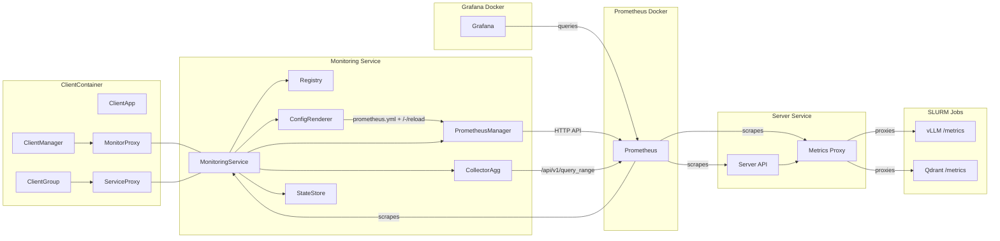

# Monitoring Service

> Unified, reproducible monitoring for end-to-end AI Factory benchmarks on MeluXina.

* **Purpose:** orchestrate Prometheus, register benchmark targets (clients, services, exporters), collect time-window metrics, and produce standardized artifacts for analysis and reports.
* **Scope (MVP):** Slurm-only orchestration (no Kubernetes), FastAPI REST API + CLI control, Prometheus hot-reload, CSV/JSON artifacts, containerized test suite.
* **Non-goals (for now):** automatic exporter deployment, long-term TSDB management, dashboards. Those are planned follow-ups.

## 🔄 Architecture Update (Nov 2024)

The monitoring service has been refactored to follow the same architecture pattern as the server service:

- **FastAPI REST API** for programmatic control (port 8002)
- **Core business logic** separated from API layer
- **Pydantic schemas** for request/response validation
- **OpenAPI documentation** at `/docs` and `/redoc`
- **Docker containerization** for deployment
- **Local Prometheus** - Runs persistently in Docker instead of SLURM (simpler development, no batch scheduler dependency)

### Key Architecture Changes

**Before:** Prometheus was deployed as a SLURM job on compute nodes
**Now:** Prometheus runs as a Docker service alongside monitoring microservice

- Monitoring service manages Prometheus via HTTP API only (no start/stop, just configure & reload)
- Server microservice proxies `/metrics` from SLURM services (vLLM, Qdrant) so Prometheus can scrape them
- Grafana connects directly to Prometheus for visualization
- Hot-reload enabled via `--web.enable-lifecycle` flag

See [`src/README.md`](src/README.md) for detailed documentation.

---

## Why this service exists

Benchmarking an **AI Factory** involves multiple components (inference servers, vector DBs, file/object stores) running across HPC nodes. We need a single, repeatable way to:

1. Tell **Prometheus** what to scrape (services under test + node/GPU exporters).
2. Launch and manage Prometheus on MeluXina via **Slurm**.
3. Collect a **specific time window** of metrics and compute KPIs (throughput, p50/p95/p99 latency, CPU/GPU utilization).
4. Save results as **artifacts** (CSV + MANIFEST.json) that downstream dashboards/report builders can consume.

---

## How we achieve it (high level)

**New Architecture (Docker-based):**

1. **Prometheus** runs as a persistent Docker service (not SLURM job)
2. **PrometheusManager** manages Prometheus via HTTP API:
   - Health checks (`/-/healthy`, `/-/ready`)
   - Configuration hot-reload (`/-/reload`)
   - PromQL queries (`/api/v1/query`, `/api/v1/query_range`)
3. **Server Metrics Proxy** exposes `/metrics` endpoints that proxy metrics from SLURM services (vLLM, Qdrant)
4. **Registry** keeps the canonical list of what to monitor (clients, services, exporters) per session
5. **ConfigRenderer** generates `prometheus.yml` from the registry and triggers hot-reload
6. **CollectorAgg** queries the Prometheus HTTP API for a given window, computes aggregates (p50/p95/p99, averages), and writes artifacts
7. **StateStore** persists session state (artifact paths, registered targets)

The **MonitoringService** facade wires these pieces together.

**Key Benefits:**
- Simpler development workflow (no SLURM dependency for Prometheus)
- Always-on monitoring (Prometheus runs continuously)
- Server microservice acts as proxy bridge between SLURM jobs and Prometheus
- Grafana can query Prometheus directly for real-time visualization

---

## Architecture overview



> **New Flow:** Prometheus runs in Docker and scrapes the Server's metrics proxy endpoints. The Server proxies `/metrics` from SLURM services (vLLM, Qdrant). Monitoring service configures Prometheus via hot-reload.

---

## Key components (what each class does)

* **MonitoringService** — Orchestration/facade:

  * `create_session`, `status`, `collect`, `delete`
  * `register_target` (updates registry → render → reload)
  * No longer starts/stops Prometheus (runs persistently in Docker)
  
* **PrometheusManager** — HTTP-based Prometheus control:

  * `is_healthy()`, `is_ready()` — Health checks
  * `reload_config()` — Triggers hot-reload via `/-/reload`
  * `query_instant()`, `query_range()` — Execute PromQL queries
  * `get_targets()` — List all scrape targets
  
* **ConfigRenderer** — Renders `prometheus.yml` from registry targets and hot-reloads Prometheus (`/-/reload`)

* **CollectorAgg** — Calls Prometheus HTTP API to pull a time window, computes KPIs (throughput, p50/p95/p99 latency, avg CPU/GPU), saves **CSV** + **MANIFEST.json**

* **Registry** — Canonical store of: clients, exporters (node/DCGM), service endpoints

* **StateStore** — Session state on disk (artifact paths, registered targets)

**Removed Components:**
* **PrometheusManager** — Replaces the older SLURM-based Prometheus manager (no SLURM control)
* ~~**SlurmRunner**~~ — No longer needed (Prometheus runs in Docker)

---

## Tech stack

**Runtime**

* Python 3.11
* FastAPI 0.104.1 - REST API framework
* Pydantic 2.5.0 + pydantic-settings 2.1.0 - Request validation and configuration
* httpx 0.25.2 - Async HTTP client for Prometheus communication
* Prometheus v2.48.0 - Metrics storage (runs in Docker)
* Docker Compose - Container orchestration
* Grafana - Metrics visualization (optional)

**Development**

* Docker - Local containerization
* Pytest - Testing framework
* Apptainer - HPC container runtime (for production deployment)

**Artifacts**

* CSV (`metrics_summary.csv`) + `MANIFEST.json` per collection window

---

## Quick Start (Docker)

### Start the monitoring stack

```bash
# Start Prometheus, Monitoring API, Server API, Grafana
docker-compose up -d

# Check services are running
docker-compose ps

# View logs
docker-compose logs -f monitoring
docker-compose logs -f prometheus
```

### API Usage

The Monitoring service exposes a FastAPI REST API on port 8002:

```bash
# Create a monitoring session
curl -X POST http://localhost:8002/api/v1/sessions \
  -H "Content-Type: application/json" \
  -d '{"session_id": "bench01"}'

# Register a target for monitoring (e.g., vLLM service)
curl -X POST http://localhost:8002/api/v1/sessions/bench01/targets \
  -H "Content-Type: application/json" \
  -d '{
    "job_id": "3607637",
    "target_type": "vllm",
    "scrape_config": {
      "job_name": "vllm-3607637",
      "metrics_path": "/metrics/vllm/3607637",
      "targets": ["server-api:8001"]
    }
  }'

# Check Prometheus targets
curl http://localhost:8002/api/v1/prometheus/targets

# Query metrics
curl -X POST http://localhost:8002/api/v1/prometheus/query \
  -H "Content-Type: application/json" \
  -d '{"query": "up"}'

# Collect metrics for a time window
curl -X POST http://localhost:8002/api/v1/sessions/bench01/collect \
  -H "Content-Type: application/json" \
  -d '{
    "start_time": "2025-01-01T10:00:00Z",
    "end_time": "2025-01-01T10:10:00Z",
    "output_dir": "/app/results"
  }'

# Get session status
curl http://localhost:8002/api/v1/sessions/bench01

# Delete session
curl -X DELETE http://localhost:8002/api/v1/sessions/bench01
```

### API Documentation

* OpenAPI docs: http://localhost:8002/docs
* ReDoc: http://localhost:8002/redoc
* Prometheus UI: http://localhost:9090
* Grafana: http://localhost:3000 (admin/admin)

---

## CLI quick start (Legacy - for reference)

> **Note:** The CLI is being deprecated in favor of the REST API. Use the API endpoints above for new development.

From the repo root:

```bash
# 1) create session
python -m services.monitoring.cli session-create --session-id bench01

# 2) register a service endpoint (/metrics)
python -m services.monitoring.cli service-register \
  --session bench01 --job-id 3607637 --name vllm --endpoint http://server-api:8001/metrics/vllm/3607637

# 3) check status (Prometheus should already be running in Docker)
python -m services.monitoring.cli status --session bench01

# 4) collect a 10-minute window
python -m services.monitoring.cli collect --session bench01 \
  --from-iso "2025-01-01T10:00:00Z" --to-iso "2025-01-01T10:10:00Z" \
  --out results/metrics

# 5) delete session
python -m services.monitoring.cli delete --session bench01
```

---

## What metrics we compute (defaults)

From Prometheus time series (if available):

* **Throughput**: `sum(rate(http_requests_total[1m]))` → average QPS
* **CPU Util**: `1 - avg(rate(node_cpu_seconds_total{mode="idle"}[1m]))` → %
* **GPU Util**: `avg(DCGM_FI_DEV_GPU_UTIL)` → %
* **Latency**: `histogram_quantile(0.50|0.95|0.99, sum by (le) (rate(http_server_request_duration_seconds_bucket[1m])))` → ms

You can adjust queries later or add recipe-specific metrics.

---

## Files & directories

```
services/monitoring/
├─ src/
│  ├─ main.py                      # FastAPI application entry point
│  ├─ routes.py                    # API route definitions
│  ├─ monitoring_service.py        # Core business logic (refactored for Docker)
│  ├─ api/
│  │  ├─ sessions.py              # Session management endpoints
│  │  ├─ targets.py               # Target registration endpoints
│  │  └─ prometheus.py            # Prometheus query endpoints
│  ├─ core/
│  │  ├─ settings.py              # Configuration management (pydantic-settings)
│  │  └─ state_store.py           # Session state persistence
│  ├─ managers/
│  │  └─ prometheus_manager.py   # HTTP-based Prometheus management
│  ├─ config/
│  │  └─ renderer.py              # prometheus.yml generation
│  ├─ metrics/
│  │  └─ collector_agg.py         # Metrics collection & aggregation
│  ├─ registry/
│  │  └─ registry.py              # Target registry
│  └─ schemas/                     # Pydantic request/response models
├─ config/
│  └─ prometheus.yml              # Prometheus scrape configuration
├─ Dockerfile                      # Service containerization
├─ requirements.txt
└─ tests/                          # Unit & integration tests
```

---

## Containerized tests (same workflow as Server)

Build & run via Apptainer:

```bash
# from repo root
cd services/monitoring
chmod +x run-tests.sh
./run-tests.sh
```

What it does:

1. Builds `tests/test-container.sif` from `tests/test-container.def`
2. If not already inside a Slurm job, requests a short interactive allocation (15m / 8GB)
3. Runs:

   * **Unit tests:** mock Slurm & HTTP
   * **Integration test:** starts a tiny in-process fake Prometheus server

Logs:

* `services/monitoring/tests/unit-test.log`
* `services/monitoring/tests/integration-test.log`

---

## Configuration & assumptions

* **Prometheus** runs as a Docker service (defined in `docker-compose.yml`)
* Prometheus is started with `--web.enable-lifecycle` so hot-reload works
* **Server microservice** proxies `/metrics` from SLURM services:
  - `/metrics/vllm/{job_id}` - Proxies vLLM metrics from SLURM job
  - `/metrics/qdrant/{job_id}` - Proxies Qdrant metrics from SLURM job
* Prometheus scrapes these proxy endpoints (reachable within Docker network)
* **Monitoring service** configures Prometheus via `prometheus.yml` updates + hot-reload
* Grafana queries Prometheus directly for visualization

### Environment Variables

Configuration is managed via `services/monitoring/src/core/settings.py`:

```bash
# Deployment mode
DEPLOYMENT_MODE=development  # or 'production'

# Prometheus connection
PROMETHEUS_URL=http://prometheus:9090
PROMETHEUS_CONFIG_PATH=/etc/prometheus/prometheus.yml

# Server API (for metrics proxying)
SERVER_API_URL=http://server-api:8001

# Scrape defaults
DEFAULT_SCRAPE_INTERVAL=15s
DEFAULT_SCRAPE_TIMEOUT=10s
```

---

## Planned evolutions

* **Enhanced API endpoints** for advanced target management and query capabilities
* **ExporterManager** to deploy/manage exporters for SLURM jobs
* **Kubernetes support** alongside SLURM deployments
* **PrometheusClient** as a standalone utility (reused across collectors)
* **Grafana dashboards** and richer artifact schemas (Parquet, per-service slices)
* **Long-term storage** integration (e.g., Thanos, Cortex)
* **Alert management** via Alertmanager integration

---

## Security notes

* The service stores only non-secret metadata (targets, job IDs, file paths).
* No credentials are persisted. If later you add secure endpoints, use project-level secrets managers and avoid embedding tokens in configs.

---

## Troubleshooting

* **Prometheus not accessible:** 
  - Check if Prometheus container is running: `docker-compose ps prometheus`
  - View Prometheus logs: `docker-compose logs prometheus`
  - Verify health: `curl http://localhost:9090/-/healthy`
  
* **No metrics from SLURM services:**
  - Confirm SLURM job is running and exposing metrics
  - Check Server metrics proxy: `curl http://localhost:8001/metrics/vllm/{job_id}`
  - Verify Prometheus targets: `curl http://localhost:9090/targets` or check UI
  
* **Reload failed:**
  - Prometheus must be started with `--web.enable-lifecycle`
  - Check prometheus.yml syntax: `docker-compose exec prometheus promtool check config /etc/prometheus/prometheus.yml`
  - View reload endpoint: `curl -X POST http://localhost:9090/-/reload`
  
* **Monitoring API errors:**
  - Check service logs: `docker-compose logs monitoring`
  - Verify Prometheus is healthy before making API calls
  - Ensure required environment variables are set

* **Docker networking issues:**
  - Verify all services are on the same Docker network
  - Check service names resolve correctly within containers
  - Use service names (e.g., `prometheus`, `server-api`) not `localhost` for inter-service communication

---
