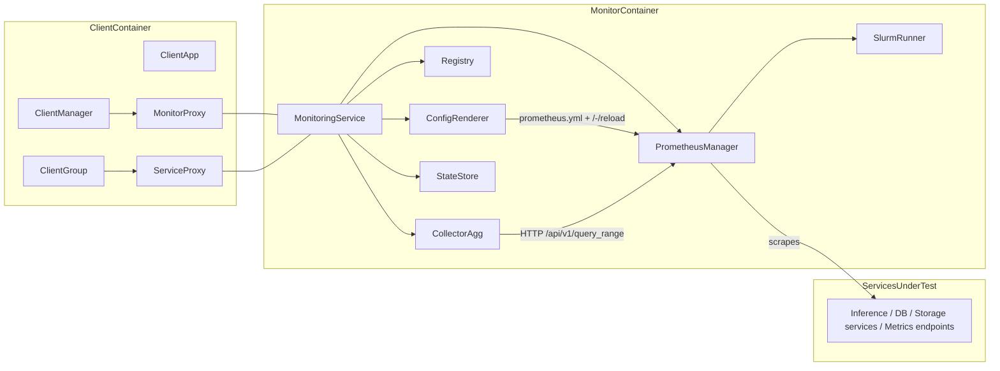

# Monitoring Service

> Unified, reproducible monitoring for end-to-end AI Factory benchmarks on MeluXina.

* **Purpose:** orchestrate Prometheus, register benchmark targets (clients, services, exporters), collect time-window metrics, and produce standardized artifacts for analysis and reports.
* **Scope (MVP):** Slurm-only orchestration (no Kubernetes), CLI control, Prometheus hot-reload, CSV/JSON artifacts, containerized test suite.
* **Non-goals (for now):** automatic exporter deployment, long-term TSDB management, dashboards. Those are planned follow-ups.

---

## Why this service exists

Benchmarking an **AI Factory** involves multiple components (inference servers, vector DBs, file/object stores) running across HPC nodes. We need a single, repeatable way to:

1. Tell **Prometheus** what to scrape (services under test + node/GPU exporters).
2. Launch and manage Prometheus on MeluXina via **Slurm**.
3. Collect a **specific time window** of metrics and compute KPIs (throughput, p50/p95/p99 latency, CPU/GPU utilization).
4. Save results as **artifacts** (CSV + MANIFEST.json) that downstream dashboards/report builders can consume.

---

## How we achieve it (high level)

1. **Registry** keeps the canonical list of what to monitor (clients, services, exporters) per session.
2. **ConfigRenderer** generates a `prometheus.yml` from the registry and hot-reloads Prometheus.
3. **PrometheusManager** starts/stops Prometheus jobs on Slurm (and checks readiness).
4. **CollectorAgg** queries the Prometheus HTTP API for a given window, computes aggregates (p50/p95/p99, averages), and writes artifacts.
5. **StateStore** persists session state (where Prometheus runs, job IDs, artifact paths).
6. **SlurmRunner** abstracts `sbatch/squeue/scancel`.

The **MonitoringService** facade wires these pieces together.

---

## Architecture overview



> In the MVP we control the service via a **CLI**. HTTP APIs (`Client2Monitor`, `ClientService2Monitor`) are planned so the **Client** module can register targets programmatically during deployments.

---

## Key components (what each class does)

* **MonitoringService** — Orchestration/facade:

  * `create_session`, `start`, `status`, `collect`, `stop`, `delete`
  * `register_client`, `register_service` (updates registry → render → reload)
* **ConfigRenderer** — Renders `prometheus.yml` from registry targets and hot-reloads Prometheus (`/-/reload`).
* **PrometheusManager** — Starts Prometheus via Slurm, checks readiness (`/-/ready`), stops it.
* **CollectorAgg** — Calls Prometheus HTTP API to pull a time window, computes KPIs (throughput, p50/p95/p99 latency, avg CPU/GPU), saves **CSV** + **MANIFEST.json**.
* **Registry** — Canonical store of: clients, exporters (node/DCGM), service endpoints.
* **StateStore** — Session state on disk (job IDs, paths, artifacts).
* **SlurmRunner** — Thin wrapper around `sbatch`, `squeue`, `scancel`.

---

## Tech stack

**Runtime**

* Python 3.11 (core code uses standard library only).
* Prometheus (binary available on cluster node).
* Slurm (MeluXina) for scheduling Prometheus.
* (Optional) node_exporter, dcgm_exporter already deployed & reachable.

**Testing**

* Apptainer container to run tests consistently.
* Pytest + mocks (unit) and a tiny in-process fake Prometheus (integration).

**Artifacts**

* CSV (`metrics_summary.csv`) + `MANIFEST.json` per collection window.

---

## CLI quick start (MVP)

From the repo root:

```bash
# 1) create session
python -m services.monitoring.cli session-create --run-id bench01 --prom-host localhost --port 9090

# 2) register a client (exporters optional)
python -m services.monitoring.cli client-connect \
  --session bench01 --client-id c1 --node nodeA \
  --node-exporter nodeA:9100 --dcgm-exporter nodeA:9400

# 3) register a service endpoint (/metrics)
python -m services.monitoring.cli service-register \
  --session bench01 --client-id c1 --name triton --endpoint http://nodeA:8000/metrics

# 4) start Prometheus on Slurm (choose a partition reachable from you)
python -m services.monitoring.cli start --session bench01 --partition login

# 5) check status
python -m services.monitoring.cli status --session bench01

# 6) collect a 10-minute window
python -m services.monitoring.cli collect --session bench01 \
  --from-iso "2025-10-01T10:00:00Z" --to-iso "2025-10-01T10:10:00Z" \
  --out results/metrics --run-id run01

# 7) stop and clean
python -m services.monitoring.cli stop --session bench01
python -m services.monitoring.cli delete --session bench01
```

**Outputs**

* State & config: `services/monitoring/state/<session_id>/`
* Logs: `logs/prometheus-<jobid>.out` (Slurm)
* Metrics: `results/metrics/metrics_summary.csv` + `MANIFEST.json`

---

## What metrics we compute (defaults)

From Prometheus time series (if available):

* **Throughput**: `sum(rate(http_requests_total[1m]))` → average QPS
* **CPU Util**: `1 - avg(rate(node_cpu_seconds_total{mode="idle"}[1m]))` → %
* **GPU Util**: `avg(DCGM_FI_DEV_GPU_UTIL)` → %
* **Latency**: `histogram_quantile(0.50|0.95|0.99, sum by (le) (rate(http_server_request_duration_seconds_bucket[1m])))` → ms

You can adjust queries later or add recipe-specific metrics.

---

## Files & directories

```
services/monitoring/
├─ cli.py                       # CLI entry points
├─ main.py                      # MonitoringService facade
├─ core/state_store.py
├─ config/renderer.py
├─ managers/slurm.py
├─ managers/prometheus.py
├─ metrics/collector_agg.py
├─ registry/registry.py
└─ tests/                       # containerized tests (see below)
```

---

## Containerized tests (same workflow as Server)

Build & run via Apptainer:

```bash
# from repo root
cd services/monitoring
chmod +x run-tests.sh
./run-tests.sh
```

What it does:

1. Builds `tests/test-container.sif` from `tests/test-container.def`
2. If not already inside a Slurm job, requests a short interactive allocation (15m / 8GB)
3. Runs:

   * **Unit tests:** mock Slurm & HTTP
   * **Integration test:** starts a tiny in-process fake Prometheus server

Logs:

* `services/monitoring/tests/unit-test.log`
* `services/monitoring/tests/integration-test.log`

---

## Configuration & assumptions

* **Prometheus binary** is available on the node where the Slurm job runs.
* Prometheus is started with `--web.enable-lifecycle` so hot-reload works.
* **Endpoints** passed to the registry must be **reachable from Prometheus** as plain HTTP/`/metrics`.
* Exporters (node/DCGM) can be omitted; service endpoints alone are enough for MVP.

---

## Planned evolutions

* **HTTP APIs** (`Client2Monitor`, `ClientService2Monitor`) via FastAPI to match the Client module’s diagram.
* **ExporterManager** to deploy/stop exporter jobs per allocation.
* **EndpointResolver** for address translation (127.0.0.1 → node-visible hostname/port).
* **PrometheusClient** as a standalone utility (reused across collectors).
* **Grafana dashboards** and richer artifact schemas (Parquet, per-service slices).

---

## Security notes

* The service stores only non-secret metadata (targets, job IDs, file paths).
* No credentials are persisted. If later you add secure endpoints, use project-level secrets managers and avoid embedding tokens in configs.

---

## Troubleshooting

* **Prometheus not ready:** check `logs/prometheus-*.out` and ensure the binary exists on the allocated node.
* **No metrics:** confirm target `/metrics` is reachable from the Prometheus job node, and that your service actually exposes metrics.
* **Reload failed:** Prometheus must be started with `--web.enable-lifecycle`; otherwise `/-/reload` returns 404.
* **Bind issues in tests:** when running Apptainer manually, bind the repo to `/app`:

  * `apptainer run --bind "$(pwd)":/app services/monitoring/tests/test-container.sif`

---
