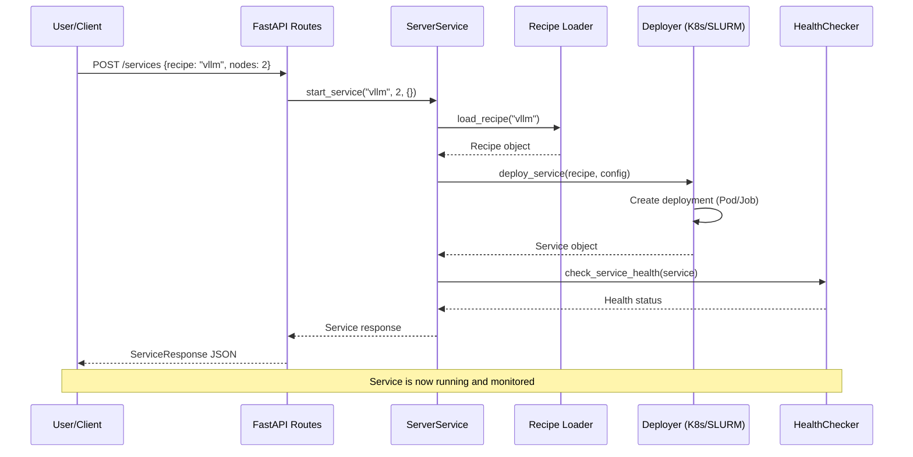

# Server Service Architecture Explanation

## Overview

The Server Service acts as the **orchestration hub** for the AI Benchmarking Factory. It manages the deployment, monitoring, and lifecycle of AI workloads across Kubernetes and SLURM.

## Architecture Layers

### 1. API Layer (`src/api/`)
**Purpose**: HTTP interface for external communication. Handle HTTP requests, validate input, serialize responses.

```
┌─────────────────────────┐
│     FastAPI Routes      │  ← REST endpoints
├─────────────────────────┤
│   Pydantic Schemas     │  ← Request/response validation
└─────────────────────────┘
```

**Modules**:
- `routes.py`: HTTP endpoints (GET /services, POST /services, etc.)
- `schemas.py`: Request validation

### 2. Server Logic Layer (`src/server_service.py`)
**Purpose**: Core orchestration logic

```
┌─────────────────────────┐
│    ServerService        │  ← Main orchestration class
│  - start_service()      │
│  - stop_service()       │
│  - list_services()      │
│  - list_recipes()       │
└─────────────────────────┘
```

- Manages service lifecycle
- Handles recipe loading and validation

### 3. Data Models (`src/models/`)
**Purpose**: Data structures representing entities in the server architecture.

```
┌─────────────────────────┐
│      Service Model      │  <- Running service instance
├─────────────────────────┤
│      Recipe Model       │  <- Deployment template
└─────────────────────────┘
```

**Entities**:
- `Service`: Represents a running AI workload (ID, status, config)
- `Recipe`: Deployment template (image, resources, what is actually deployed on the server)

### 4. Deployment Layer (`src/deployment/`)
**Purpose**: Platform-specific deployment logic

```
┌─────────────────────────┐
│  KubernetesDeployer     │  <- K8s cluster management
├─────────────────────────┤
│    SlurmDeployer        │  <- HPC job submission
└─────────────────────────┘
```

### 5. Recipe System (`src/recipes/`)
**Purpose**: Predefined deployment configs

```
recipes/
├── inference/       <- AI model serving (vLLM, Triton)
├── storage/         <- Data persistence (MinIO, PostgreSQL)  
└── vector-db/       <- Embedding storage (Chroma, FAISS)
```

### 6. Health Monitoring (`src/health/`)
**Purpose**: TBD

## Request Flow Example

```
1. Client Request
   POST /services {"recipe_name": "vllm", "nodes": 2}
   ↓
2. FastAPI Route (routes.py)
   create_service(request: ServiceRequest)
   ↓
3. Server Logic (server_service.py)
   ServerService.start_service(recipe_name, nodes, config)
   ↓
4. Recipe Loading
   Load vllm.yaml configuration
   ↓
5. Platform Selection
   Choose SlurmDeployer for GPU workload
   ↓
6. Deployment
   Generate SLURM batch script, submit job
   ↓
7. Service Tracking
   Create Service model, return to client

When user stops the service, the job is canceled.
```


